# AUDIT VZ-3 — La jauge de proximité rendue lisible sans explication

## Position du dépôt au départ
- Worktree dédié : `C:/MyPythonProjects/wt-vz-3`, branche **`fix/vz-3-jauge-proximite`** créée depuis `origin/main`.
- **HEAD au départ = `769d57e`** (PR #171 `fix/str-2-structure`), **0 commit d'écart** avec `origin/main` (à jour au moment du `git fetch`).
- ⚠️ Le dépôt primaire d'où la mission a été lancée était en *detached HEAD `e506735`, 9 commits derrière* `origin/main` — le diagnostic et le code ont été faits dans le worktree à jour, pas là.
- **Coordination VZ-2** : PR #170 (`afb7342`) déjà mergée dans `origin/main` → VZ-3 traité en **mission séparée** (jamais en parallèle de VZ-2).

Composant : `webapp/components/zones/ZoneLifecycleCard.tsx` (`ProximityBlock`).
Géométrie : `webapp/lib/zones/gauge.ts` (nouveau).
Styles : `webapp/components/shell/pages.css` (bloc `.zgauge`).
Distance (source unique) : `webapp/lib/zones/lifecycle.ts::zoneProximity`.

---

## 1. Diagnostic (lecture seule)

### A) D'où venaient les anciennes bornes — **pas arbitraires, mais muettes**
Ancien code (`ZoneLifecycleCard.tsx`, avant) :
```js
const lo  = Math.min(zone.levelLow,  price);
const hi  = Math.max(zone.levelHigh, price);
const pad = Math.max((hi - lo) * 0.18, (zone.levelHigh - zone.levelLow) || 1) * 0.5;
const eLo = lo - pad;   // nombre affiché à gauche
const eHi = hi + pad;   // nombre affiché à droite
```
La fenêtre s'étirait pour **englober la zone ET le prix**, plus une marge `0,5 × max(0,18·(hi−lo) ; hauteur_zone)`. Reproduit exactement sur l'exemple d'origine (zone 4407,84–4413,53, prix ≈ 4417,99) : `eLo = 4405,00`, `eHi = 4420,84` — les deux nombres observés, **au caractère près**. Ils *mesuraient* donc quelque chose (les extrémités de la fenêtre), mais **rien ne les nommait** → illisibles. Conclusion : on pouvait reconstruire proprement, ce ne sont pas des valeurs inventées.

**Effet de bord de cette règle** : comme la fenêtre incluait toujours le prix, il n'existait **aucun cas « hors fenêtre »** ; c'est la **bande qui rétrécissait jusqu'au filet invisible** quand le prix s'éloignait (le défaut décrit). La nouvelle fenêtre fixe *crée* le cas hors-fenêtre, désormais géré explicitement.

### B) Les quatre cas limites (avant)
- **À l'intérieur** : jauge rendue, repère vert dans la bande, deux nombres muets aux bouts.
- **Très loin** : bande → filet invisible (fraction = `hauteur_zone / (1,18·(hi−lo))` → 0).
- **Au-dessus / en dessous** : symétrique, repère borné `[0,100]`.
- **Prix absent** : `zoneProximity` renvoie `null` → toute la section disparaît (pas de conteneur vide) — déjà conforme.

### C) Duplication des chiffres — **aucune duplication numérique avant**
L'ancienne jauge n'affichait **aucun chiffre de distance**, seulement les extents `eLo/eHi`. L'écart chiffré (« 4,46 pts / 0,10 % ») venait d'une **source unique** : `prox.distance` / `prox.distancePct` via `fmt.points` / `fmt.pctShort`. Le risque de contradiction n'apparaissait **que si** on ajoutait un crochet chiffré avec un second calcul — ce que VZ-3 évite (voir §2).

### D) Étroit (390 px), avant
Les deux nombres muets étaient aux extrêmes opposés → pas de chevauchement. Le risque de chevauchement naissait des **nouvelles** étiquettes nommées → traité par la séparation en rangées + effacement des bornes en dernier recours (§2).

### Couleur (avant)
`.gpx { background: var(--bull) }`, `--bull: #37b98c` = **vert** = « achat » dans les 4 thèmes. Remplacé par `var(--txt)` (blanc cassé, neutre).

### Maquette de référence
`docs/design/reference-zones.html` **existe** mais contient **la jauge défectueuse** (repère `var(--pos)` vert, bornes muettes, pas de nom, pas de crochet). C'est le « avant », pas la cible. **Décision validée avec le donneur d'ordre : la spec §2 de la mission fait autorité** pour ce composant ; le mock reste la référence pour le reste de la carte.

---

## 2. Ce qui a été construit (règles retenues)

Les cinq éléments, chacun **nommé** : une **piste** (fenêtre), une **bande** libellée « la zone », les **deux bornes de la zone** en chasse fixe sous les bouts de bande, un **repère de prix** neutre libellé « prix » + valeur, un **crochet de mesure** partant du bord de référence portant l'écart.

- **Règle de la nouvelle fenêtre (une phrase)** : *la fenêtre couvre la zone plus une marge égale à la moitié de la hauteur de la zone de chaque côté, de sorte que la bande occupe toujours les 50 % centraux de la piste (25 %–75 %).* Les anciens nombres aux extrémités de la piste sont **supprimés**.
- **Règle « hors fenêtre » (une phrase)** : *quand le prix dépasse la marge, la jauge ne déforme pas la bande ; elle épingle un repère au bord concerné, marqué en toutes lettres « hors cadre » avec une flèche directionnelle, et ne trace aucun crochet* (l'écart chiffré reste dans la ligne de texte au-dessus).
- **À l'intérieur** : repère dans la bande, **aucun crochet**, la ligne de texte dit « le prix est à l'intérieur… ».
- **Donnée absente** : `zoneProximity` → `null` → **aucune jauge, aucun conteneur** (inchangé, déjà conforme).

**Cohérence des chiffres** : l'écart du crochet réutilise **la chaîne exacte** `fmt.points(prox.distance, instrument)` qui alimente la ligne de texte (calculée une seule fois, `distanceText`). Un test unitaire garantit l'égalité au caractère près.

**Étroit (390 px)** : les étiquettes sont réparties en **trois rangées verticales disjointes** (prix au-dessus · piste/bande/crochet · bornes de zone en dessous) → aucun chevauchement possible par construction ; en dernier recours (`@container ≤ 250px`) ce sont **les bornes de zone qui s'effacent**, jamais le repère de prix ni l'écart.

**Accessibilité** : la jauge est `role="img"` avec un `aria-label` complet (« la zone de X à Y, prix Z, » + la phrase de distance) ; les visuels internes sont `aria-hidden`. Aucune information ne dépend de la seule couleur ou position.

**Non négociables respectés** : aucune couleur directionnelle (repère = `var(--txt)`, bande = accent neutre ; guard test qui interdit `--bull/--bear/green/red` dans le bloc CSS) ; aucun jugement ; aucune projection ; aucun nom de statistique ; chaque mesure porte son unité ; rien n'est affiché avant chargement.

---

## 3. Tests

- **Géométrie** (`lib/zones/__tests__/gauge.test.ts`) : les 4+1 états (au-dessus / en dessous / à l'intérieur / hors-fenêtre haut / bas), bande toujours à 25 %–75 %, pas de division par zéro.
- **Composant** (`components/zones/__tests__/ZoneGauge.test.tsx`) : chaque état rend le bon visuel ; **écart de la jauge == écart de la ligne de texte, caractère pour caractère** ; à l'intérieur → **aucun crochet** ; prix absent → **rien** (pas de conteneur) ; `aria-label` contient zone + prix + distance.
- **Couleur** (`components/zones/__tests__/gauge-no-direction-color.test.ts`) : le bloc CSS `.zgauge` ne contient **ni vert, ni rouge, ni `--bull/--bear`**.
- **Playwright** (`tests/e2e/vz-3-measure.spec.ts`) : le crochet n'apparaît **que** là où une distance existe ; à **390 px aucune étiquette ne se superpose** à une autre.
- **Suite complète** : `tsc` 0 · `next build` OK · **vitest 941/941** · Playwright vz-3 12/12 (shots + measure, 2 projets).

---

## 4. Captures avant / après (fr · 1280×800 sauf mention)

Répertoire complet (fr+en, 1280×800 et 390×844) : `docs/audits/vz-3/`.

### Prix au-dessus de la zone (dans la fenêtre)
| Avant | Après |
|---|---|
| 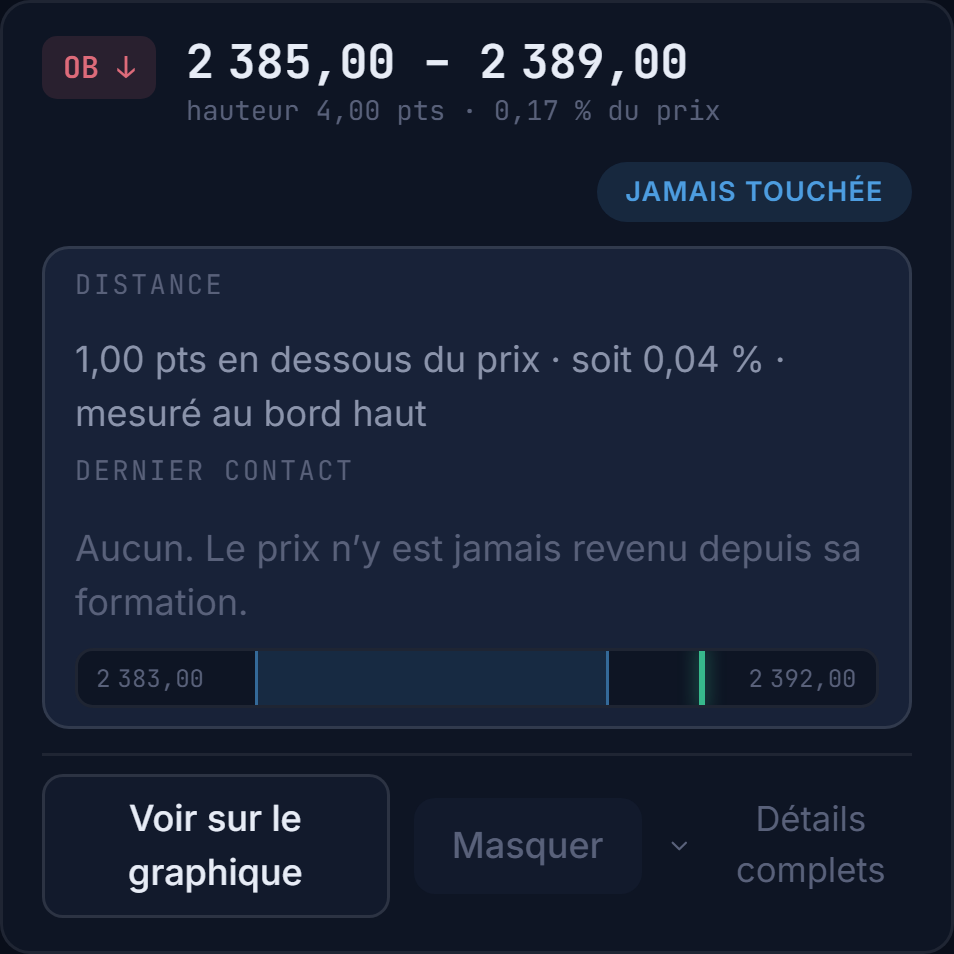 | 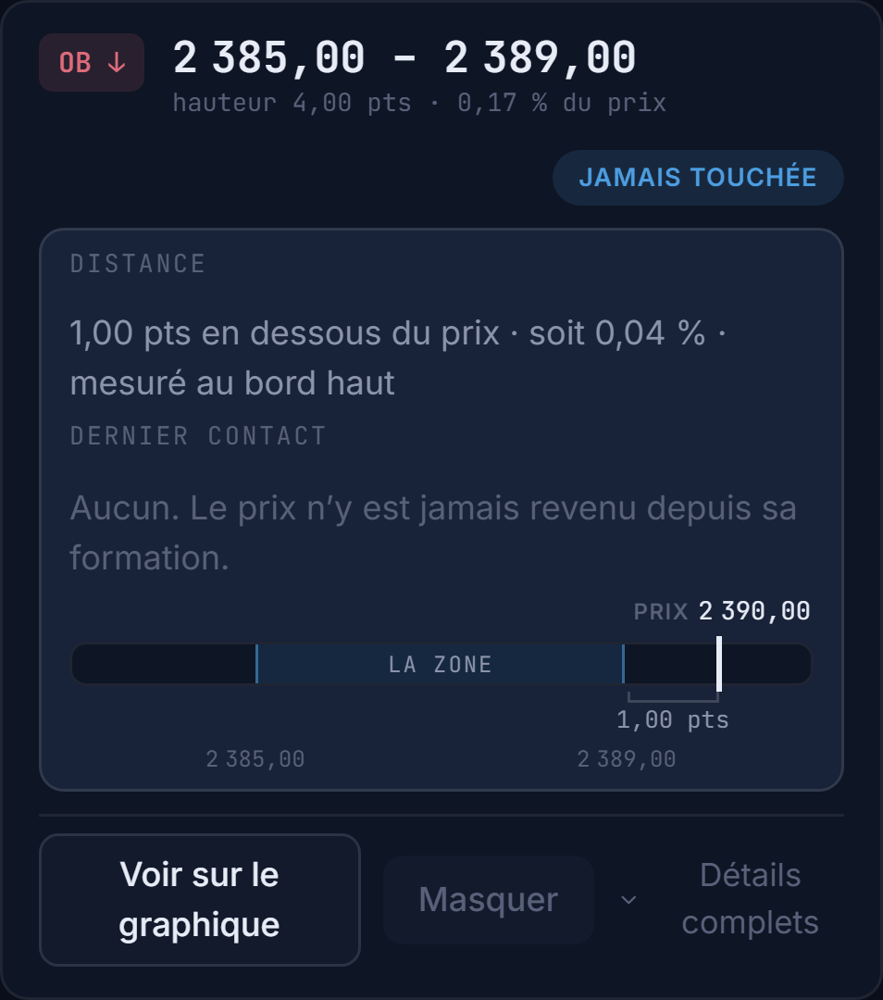 |

### Prix en dessous de la zone (dans la fenêtre)
| Avant | Après |
|---|---|
| 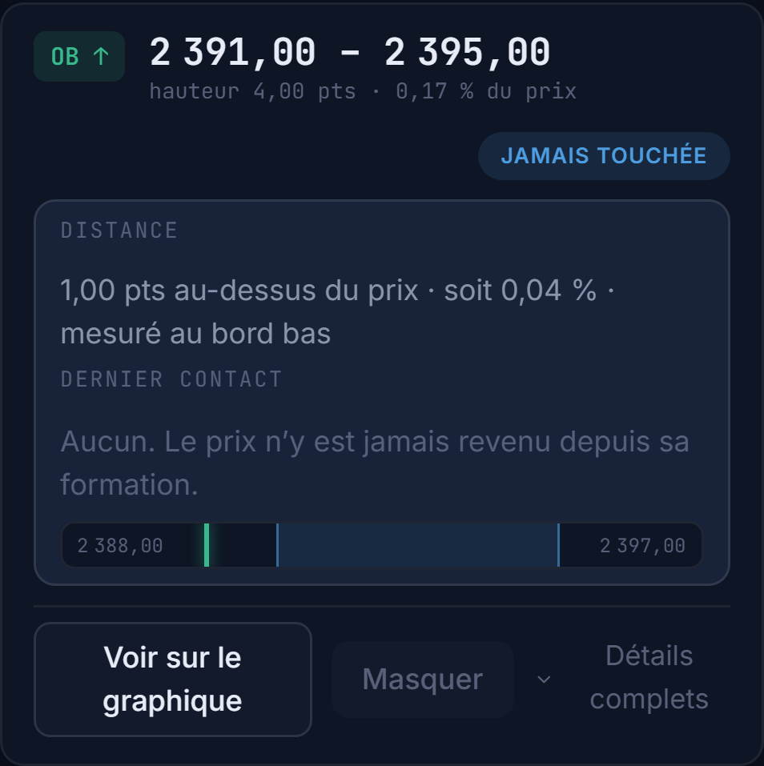 | 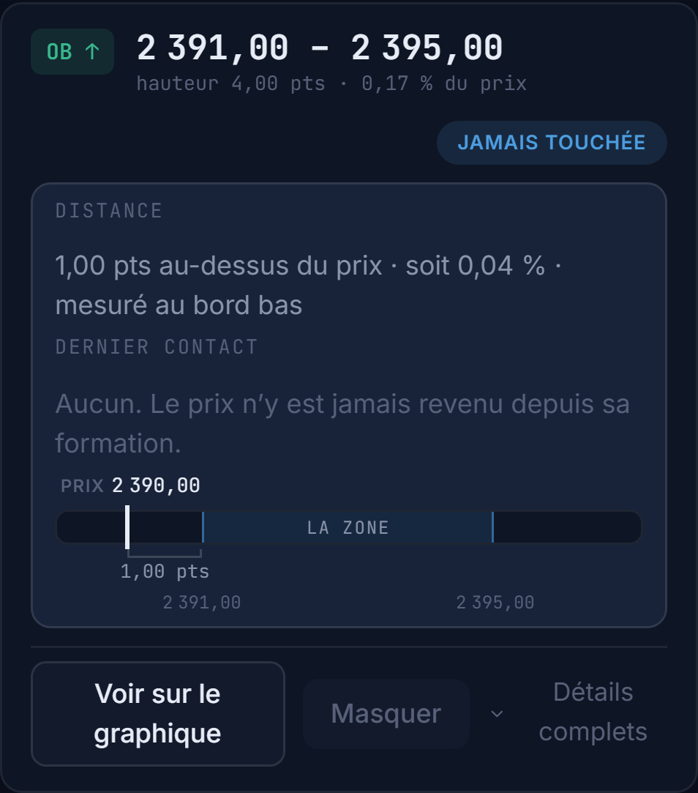 |

### Prix à l'intérieur de la zone (aucun crochet)
| Avant | Après |
|---|---|
| 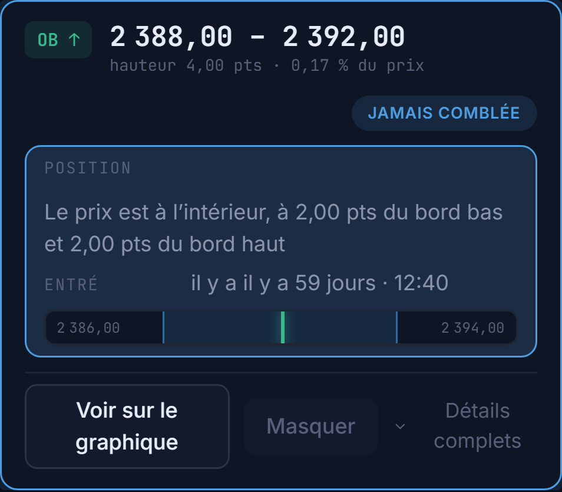 | 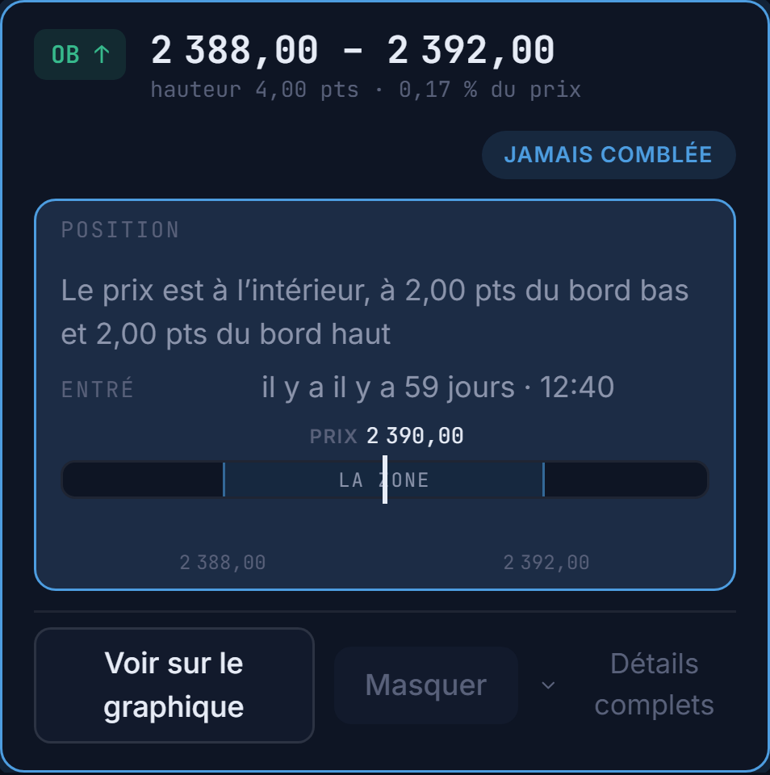 |

### Prix hors fenêtre (repère de bord « hors cadre »)
| Avant | Après |
|---|---|
| 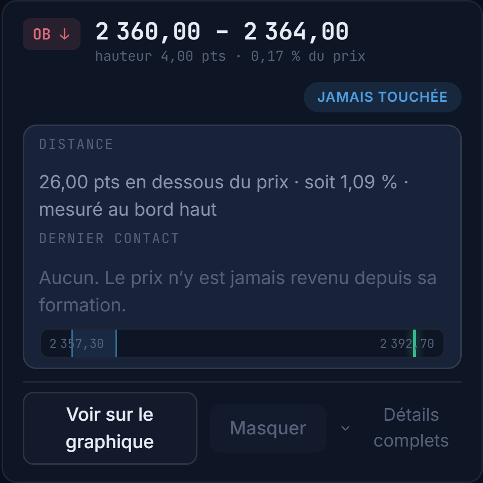 | 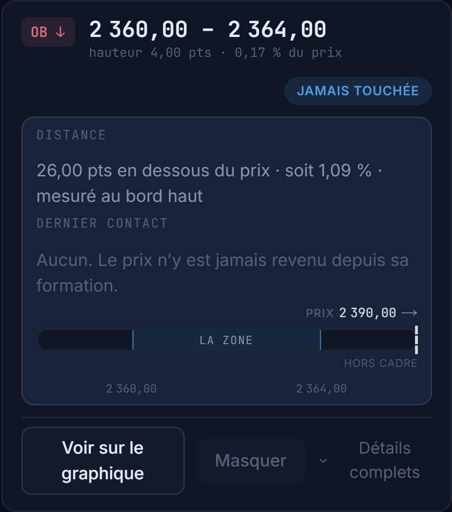 |

### Étroit — 390×844 (aucun chevauchement)
| Avant | Après |
|---|---|
| 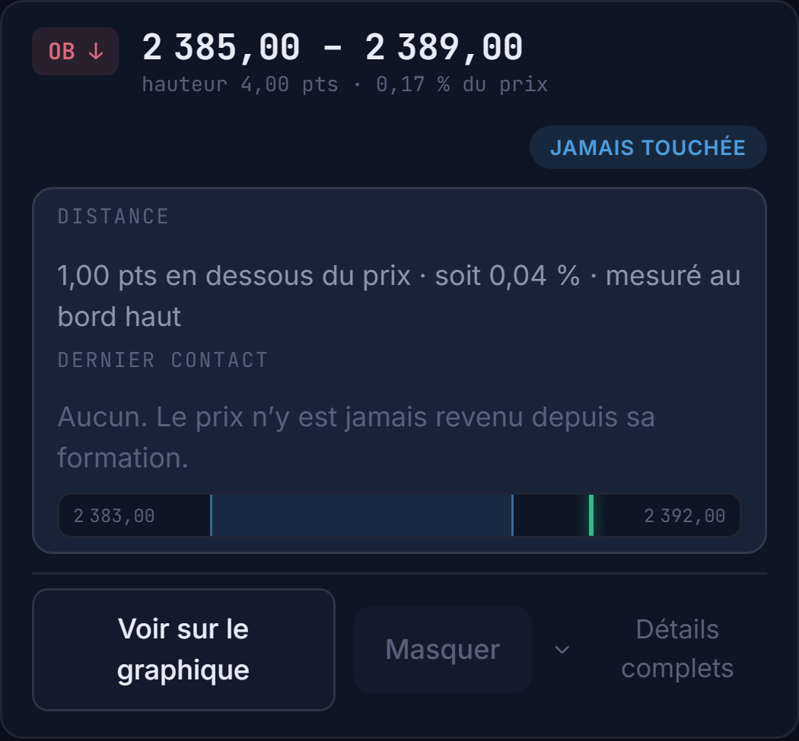 | 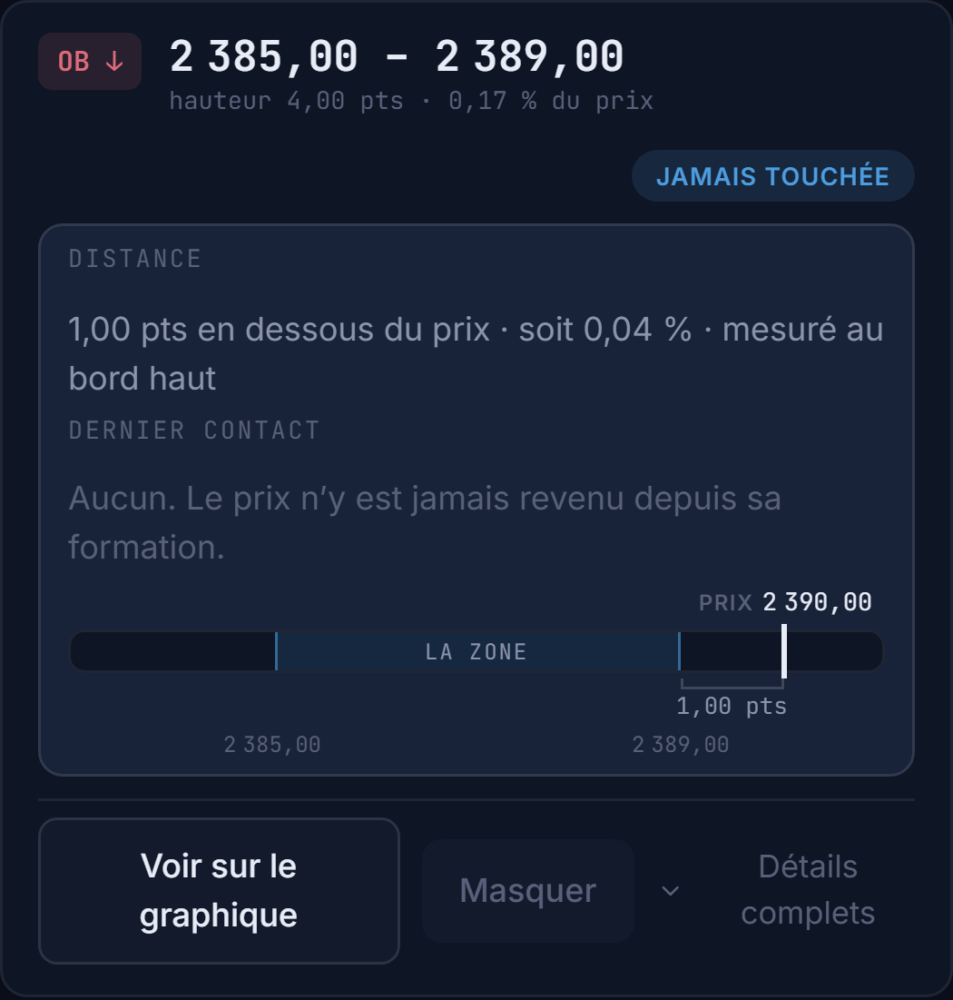 |

### Anglais (parité) — hors fenêtre, 1280×800
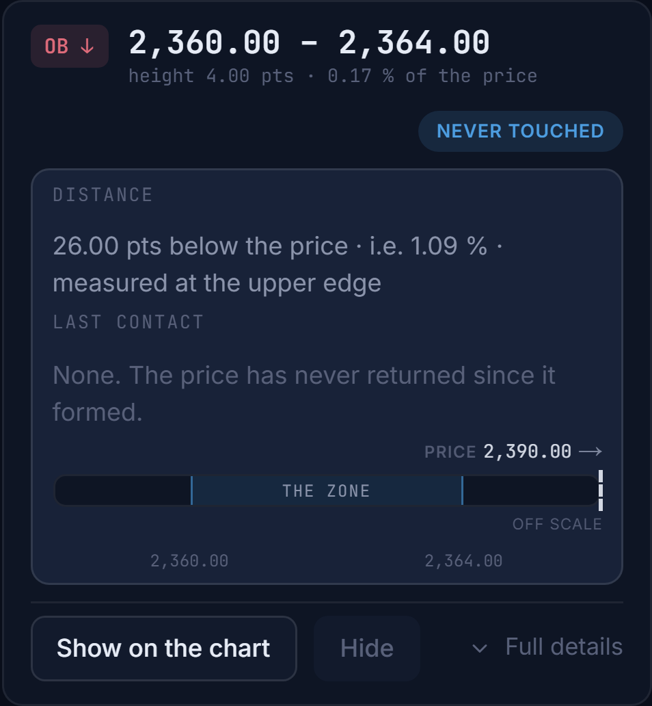

---

## 5. Observation hors périmètre (non corrigée)
Sur une zone où le prix est **à l'intérieur**, la ligne « Entré » affiche « **il y a il y a 59 jours** » : le gabarit i18n `proximity.enteredAt` = « il y a {when} … » préfixe « il y a », alors que `fmt.relativePast(...)` renvoie déjà « il y a X ». Bug **pré-existant**, dans la ligne « Entré » (pas la jauge) → laissé intact pour respecter le périmètre strictement jauge. À corriger en suivi (retirer « il y a » du gabarit ou de `relativePast`).

## Discipline
Périmètre strictement présentationnel : **aucun calcul de zone ni de distance modifié** (le crochet réutilise `prox.distance` existant). Staging explicite (pas de `git add -A`). **Pas de merge sur `main` avant confirmation visuelle live.**
