# Échantillon de détection à annoter — XAUUSD H1 & M15 — 2026-07-29

**Mission MT-D1.** Ce dossier n'affirme rien : il **montre** ce que le moteur
détecte et ce qu'il écarte, pour que **vous, le trader**, jugiez. Aucune règle
n'a été modifiée pour le produire. Les images couvrent une période réelle de
~60 jours (données Twelve Data, horodatages **UTC**).

## Comment annoter

1. Copiez `ANNOTATION.csv` en `ANNOTATION-<votre-nom>.csv` (un fichier par
   trader, annotation **indépendante** — on comparera ensuite les jugements).
2. Pour chaque cas, renseignez `verdict` (`d_accord`, `pas_d_accord`,
   `incertain`) et un `commentaire` libre. Mettez votre nom dans `annotateur`.
3. Ce `README.md` est le **visualiseur** : il montre chaque graphique avec sa
   question. Les cases à cocher ici sont pour une lecture papier ; la saisie
   qui sera dépouillée est le CSV.

## Légende des graphiques

- Chandeliers verts/rouges = bougies. Ligne pointillée bleue = **la bougie du
  cas**. Ligne mauve = **niveau structurel** (creux/sommet fractal concerné).
- Section 3A (EVT) : événements **émis** par le moteur.
- Section 3B (NON) : moments où un swing a été **franchi sans** qu'aucun
  événement soit émis — avec la condition qui a bloqué. **C'est la partie que le
  produit ne montre jamais aujourd'hui.**
- Section 8 (EXTRA) : événements qui **seraient** émis si le franchissement se
  faisait « en mèche » au lieu de « en clôture » (le levier le plus influent de
  l'analyse de sensibilité) — vrais événements ou bruit ?
- OPENCASE : le cas ouvert DG-1 (24→28 juillet).

---

## Section 4 — Cas ouvert DG-1

La dérive du 24 au 28 juillet a-t-elle été correctement laissée sans événement ? (ligne orange = creux protégé, jamais clôturé sous)

### OPENCASE — H1 — 2026-07-24 23:00:00+00:00
*Derive 24->28 juil sans evenement ; creux protege jamais cloture sous*  
**Question : D'accord : derive correcte sans CHOCH manque ?**  
Verdict : ☐ d'accord ☐ pas d'accord ☐ incertain — Commentaire : ______

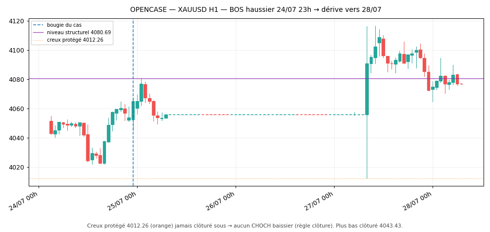

---

## Section 3A — 25 événements ÉMIS

Pour chacun : est-ce un vrai BOS/CHOCH selon votre lecture ?

### EVT-01 — M15 — 2026-06-10 21:45:00+00:00
*BOS bearish niveau 4155.41*  
**Question : Cet événement ÉMIS est-il un vrai BOS/CHOCH ?**  
Verdict : ☐ d'accord ☐ pas d'accord ☐ incertain — Commentaire : ______

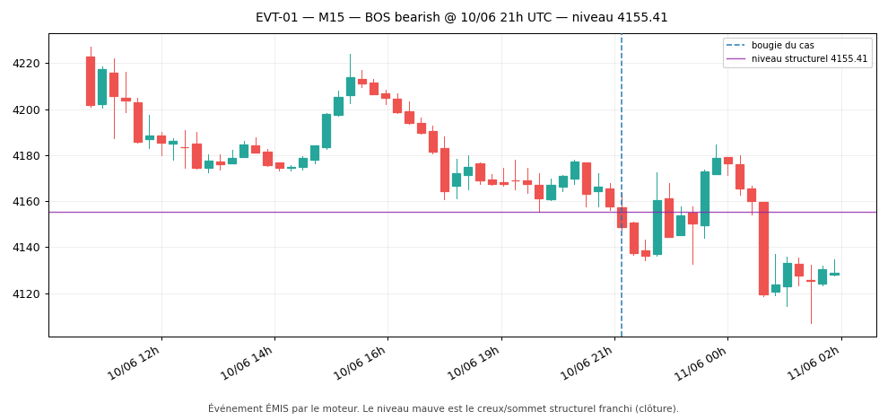

### EVT-02 — H1 — 2026-07-23 17:00:00+00:00
*CHOCH bearish niveau 4109.15*  
**Question : Cet événement ÉMIS est-il un vrai BOS/CHOCH ?**  
Verdict : ☐ d'accord ☐ pas d'accord ☐ incertain — Commentaire : ______

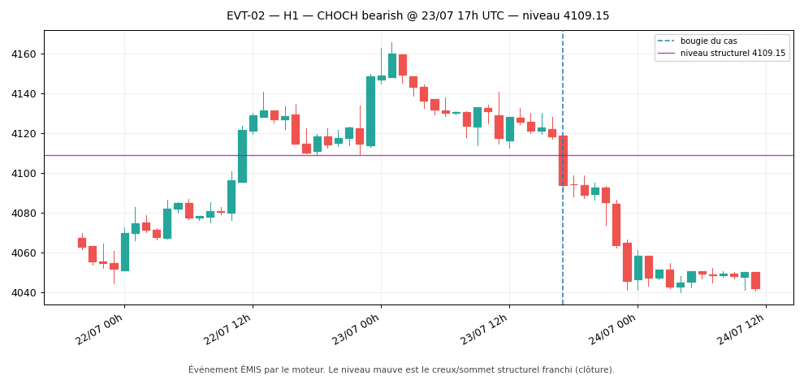

### EVT-03 — H1 — 2026-07-09 01:00:00+00:00
*BOS bearish niveau 4041.55*  
**Question : Cet événement ÉMIS est-il un vrai BOS/CHOCH ?**  
Verdict : ☐ d'accord ☐ pas d'accord ☐ incertain — Commentaire : ______

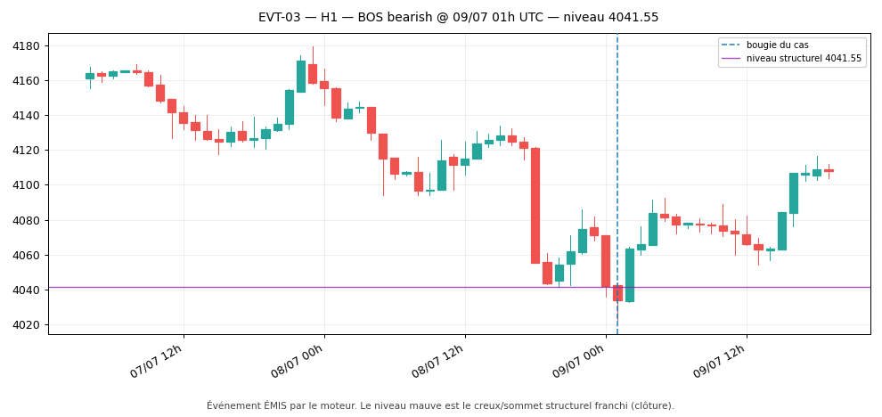

### EVT-04 — H1 — 2026-07-24 23:00:00+00:00
*BOS bullish niveau 4064.73*  
**Question : Cet événement ÉMIS est-il un vrai BOS/CHOCH ?**  
Verdict : ☐ d'accord ☐ pas d'accord ☐ incertain — Commentaire : ______

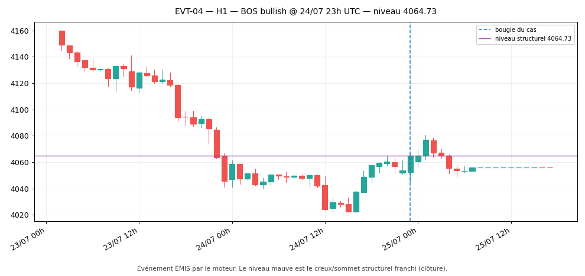

### EVT-05 — H1 — 2026-06-04 21:00:00+00:00
*CHOCH bullish niveau 4496.2*  
**Question : Cet événement ÉMIS est-il un vrai BOS/CHOCH ?**  
Verdict : ☐ d'accord ☐ pas d'accord ☐ incertain — Commentaire : ______

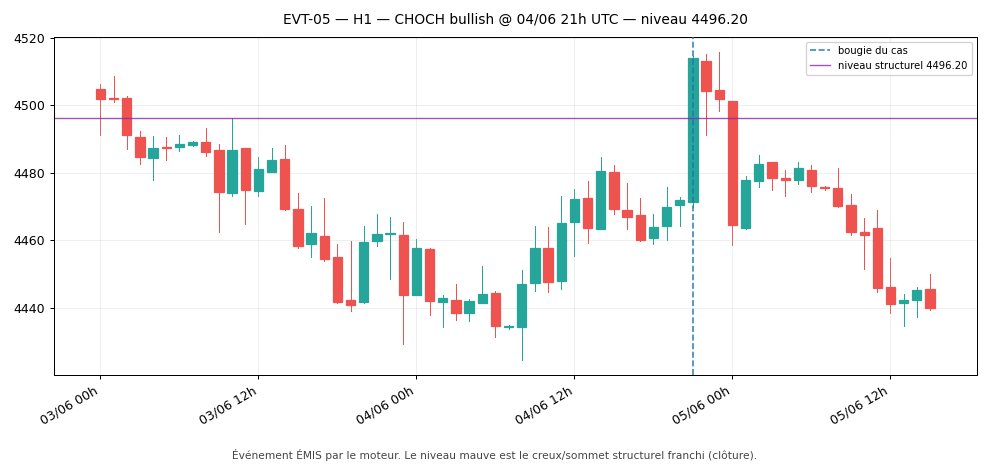

### EVT-06 — M15 — 2026-07-14 12:15:00+00:00
*CHOCH bullish niveau 4017.52*  
**Question : Cet événement ÉMIS est-il un vrai BOS/CHOCH ?**  
Verdict : ☐ d'accord ☐ pas d'accord ☐ incertain — Commentaire : ______

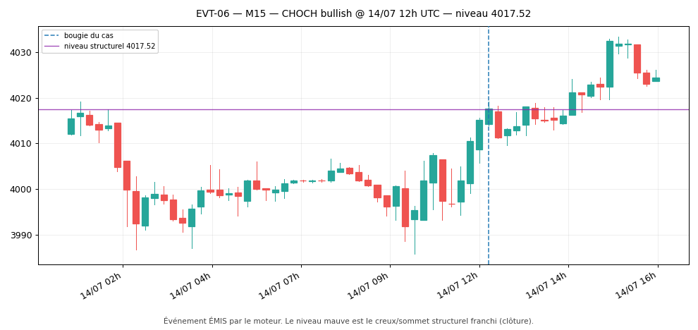

### EVT-07 — M15 — 2026-06-12 03:30:00+00:00
*BOS bullish niveau 4116.97*  
**Question : Cet événement ÉMIS est-il un vrai BOS/CHOCH ?**  
Verdict : ☐ d'accord ☐ pas d'accord ☐ incertain — Commentaire : ______

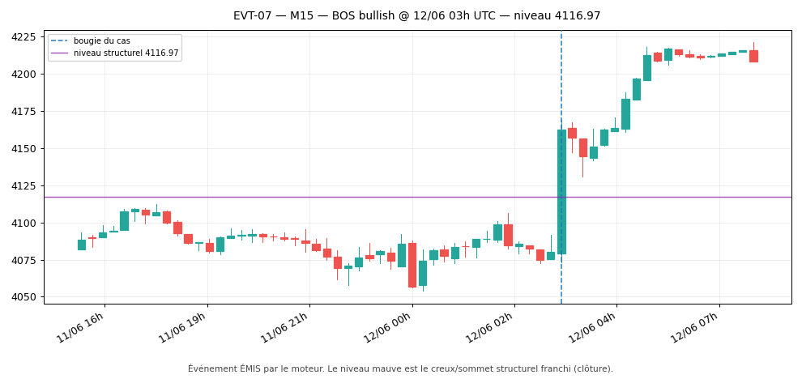

### EVT-08 — M15 — 2026-07-16 22:30:00+00:00
*CHOCH bearish niveau 4012.55*  
**Question : Cet événement ÉMIS est-il un vrai BOS/CHOCH ?**  
Verdict : ☐ d'accord ☐ pas d'accord ☐ incertain — Commentaire : ______

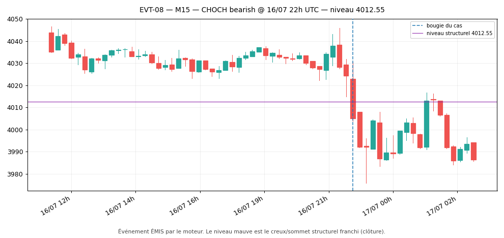

### EVT-09 — M15 — 2026-06-03 04:30:00+00:00
*BOS bearish niveau 4482.64*  
**Question : Cet événement ÉMIS est-il un vrai BOS/CHOCH ?**  
Verdict : ☐ d'accord ☐ pas d'accord ☐ incertain — Commentaire : ______

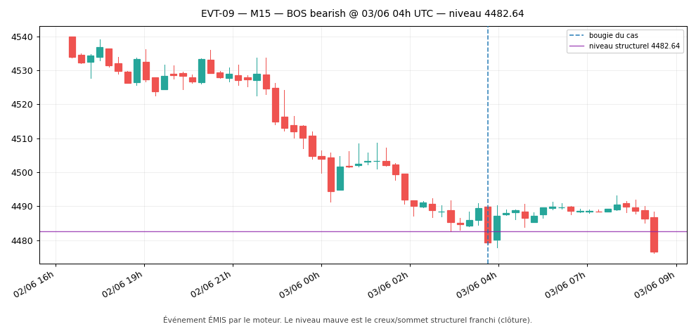

### EVT-10 — H1 — 2026-06-18 04:00:00+00:00
*CHOCH bearish niveau 4320.03*  
**Question : Cet événement ÉMIS est-il un vrai BOS/CHOCH ?**  
Verdict : ☐ d'accord ☐ pas d'accord ☐ incertain — Commentaire : ______

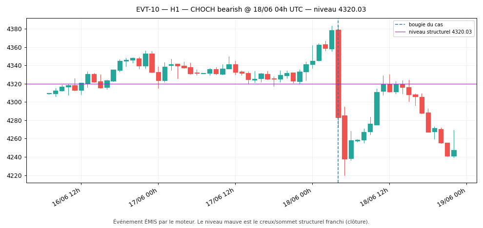

### EVT-11 — H1 — 2026-06-19 09:00:00+00:00
*BOS bearish niveau 4202.12*  
**Question : Cet événement ÉMIS est-il un vrai BOS/CHOCH ?**  
Verdict : ☐ d'accord ☐ pas d'accord ☐ incertain — Commentaire : ______

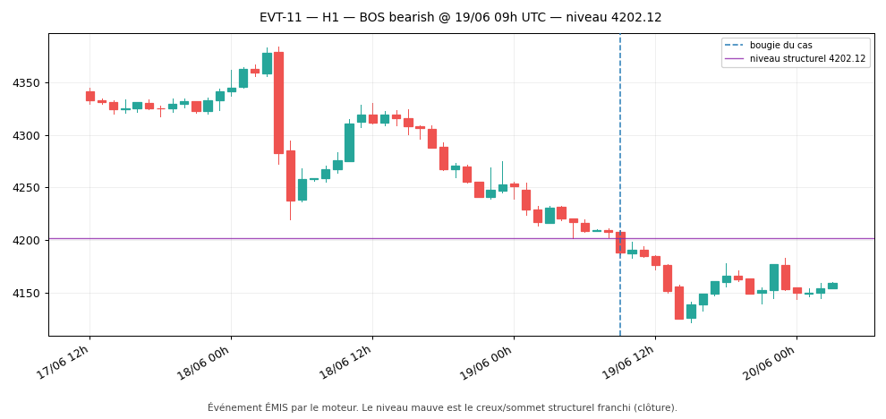

### EVT-12 — H1 — 2026-07-22 10:00:00+00:00
*BOS bullish niveau 4086.91*  
**Question : Cet événement ÉMIS est-il un vrai BOS/CHOCH ?**  
Verdict : ☐ d'accord ☐ pas d'accord ☐ incertain — Commentaire : ______

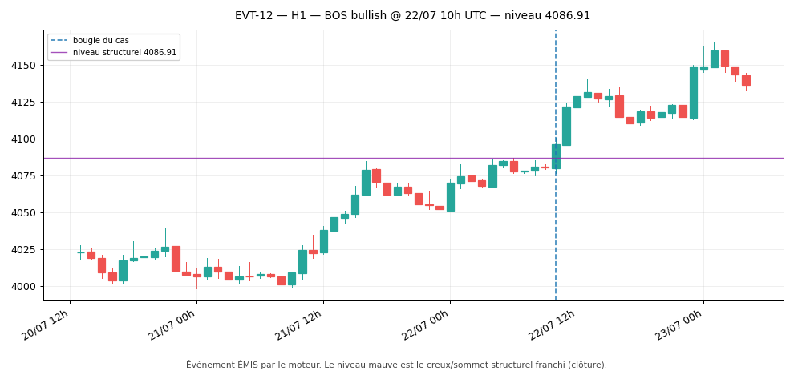

### EVT-13 — H1 — 2026-07-02 22:00:00+00:00
*CHOCH bullish niveau 4115.77*  
**Question : Cet événement ÉMIS est-il un vrai BOS/CHOCH ?**  
Verdict : ☐ d'accord ☐ pas d'accord ☐ incertain — Commentaire : ______

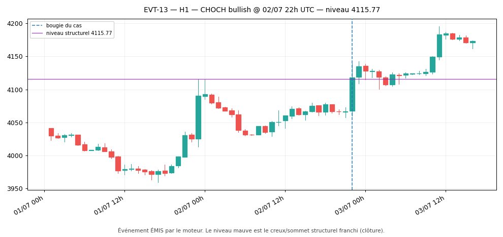

### EVT-14 — M15 — 2026-06-26 22:45:00+00:00
*CHOCH bullish niveau 4056.47*  
**Question : Cet événement ÉMIS est-il un vrai BOS/CHOCH ?**  
Verdict : ☐ d'accord ☐ pas d'accord ☐ incertain — Commentaire : ______

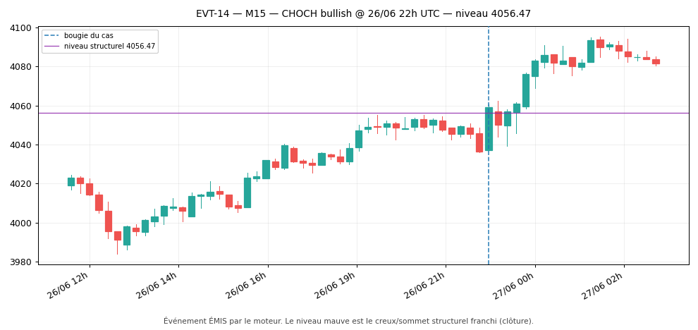

### EVT-15 — M15 — 2026-07-01 00:00:00+00:00
*BOS bullish niveau 4036.94*  
**Question : Cet événement ÉMIS est-il un vrai BOS/CHOCH ?**  
Verdict : ☐ d'accord ☐ pas d'accord ☐ incertain — Commentaire : ______

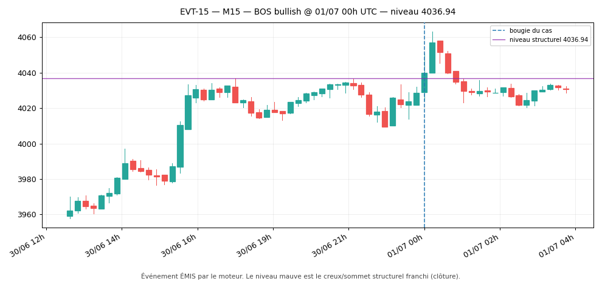

### EVT-16 — M15 — 2026-06-16 03:30:00+00:00
*CHOCH bearish niveau 4325.82*  
**Question : Cet événement ÉMIS est-il un vrai BOS/CHOCH ?**  
Verdict : ☐ d'accord ☐ pas d'accord ☐ incertain — Commentaire : ______

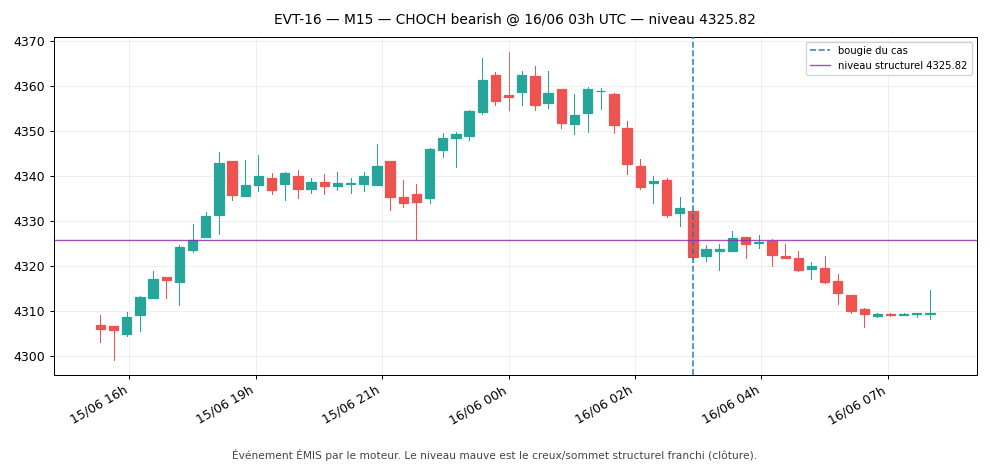

### EVT-17 — M15 — 2026-06-02 22:45:00+00:00
*BOS bearish niveau 4516.71*  
**Question : Cet événement ÉMIS est-il un vrai BOS/CHOCH ?**  
Verdict : ☐ d'accord ☐ pas d'accord ☐ incertain — Commentaire : ______

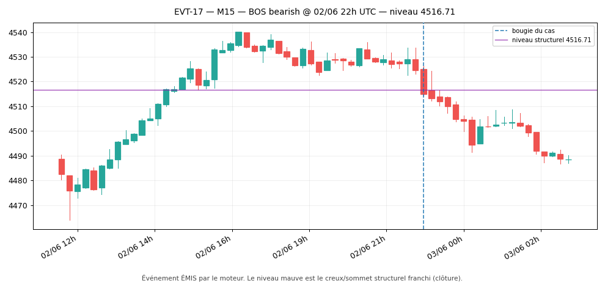

### EVT-18 — H1 — 2026-07-08 18:00:00+00:00
*CHOCH bearish niveau 4093.98*  
**Question : Cet événement ÉMIS est-il un vrai BOS/CHOCH ?**  
Verdict : ☐ d'accord ☐ pas d'accord ☐ incertain — Commentaire : ______

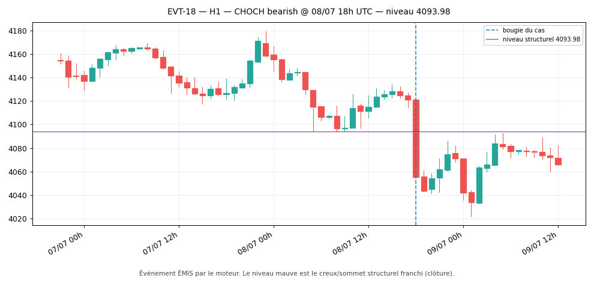

### EVT-19 — H1 — 2026-06-01 23:00:00+00:00
*BOS bearish niveau 4490.95*  
**Question : Cet événement ÉMIS est-il un vrai BOS/CHOCH ?**  
Verdict : ☐ d'accord ☐ pas d'accord ☐ incertain — Commentaire : ______

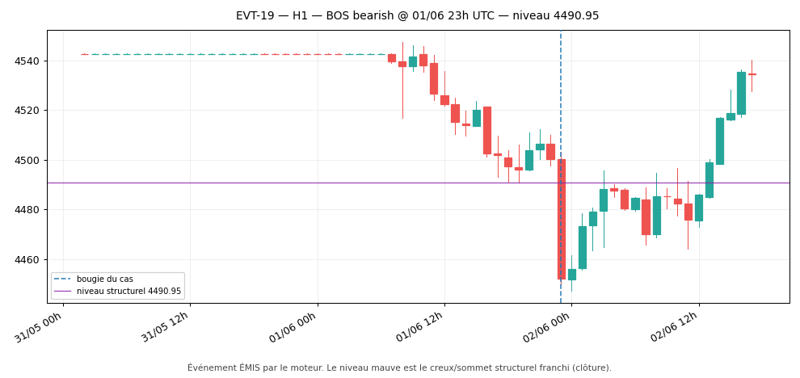

### EVT-20 — H1 — 2026-07-18 01:00:00+00:00
*BOS bullish niveau 4002.4*  
**Question : Cet événement ÉMIS est-il un vrai BOS/CHOCH ?**  
Verdict : ☐ d'accord ☐ pas d'accord ☐ incertain — Commentaire : ______

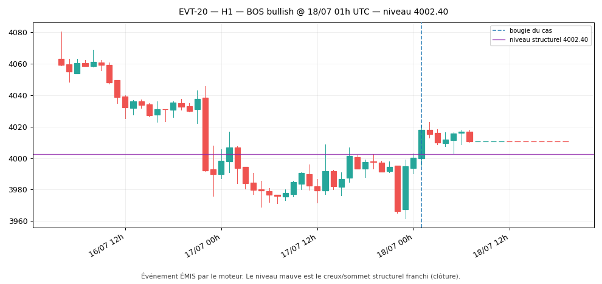

### EVT-21 — H1 — 2026-06-02 14:00:00+00:00
*CHOCH bullish niveau 4512.23*  
**Question : Cet événement ÉMIS est-il un vrai BOS/CHOCH ?**  
Verdict : ☐ d'accord ☐ pas d'accord ☐ incertain — Commentaire : ______

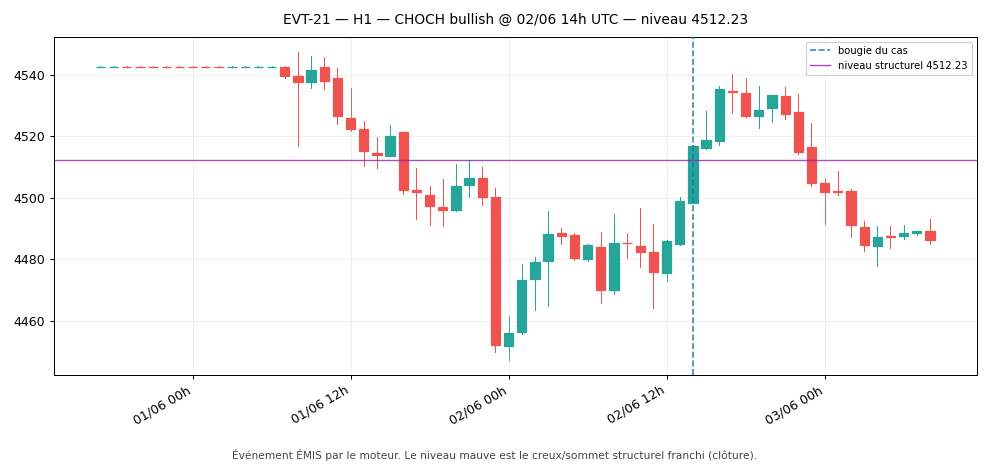

### EVT-22 — M15 — 2026-06-16 22:45:00+00:00
*CHOCH bullish niveau 4349.34*  
**Question : Cet événement ÉMIS est-il un vrai BOS/CHOCH ?**  
Verdict : ☐ d'accord ☐ pas d'accord ☐ incertain — Commentaire : ______

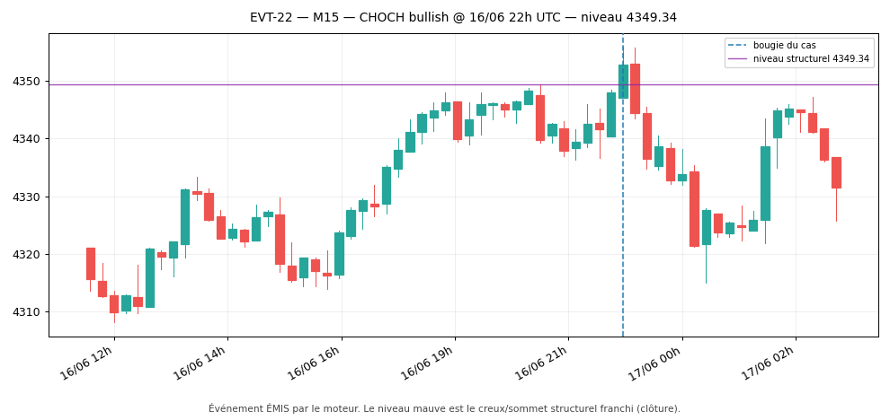

### EVT-23 — M15 — 2026-07-01 18:15:00+00:00
*BOS bullish niveau 3979.16*  
**Question : Cet événement ÉMIS est-il un vrai BOS/CHOCH ?**  
Verdict : ☐ d'accord ☐ pas d'accord ☐ incertain — Commentaire : ______

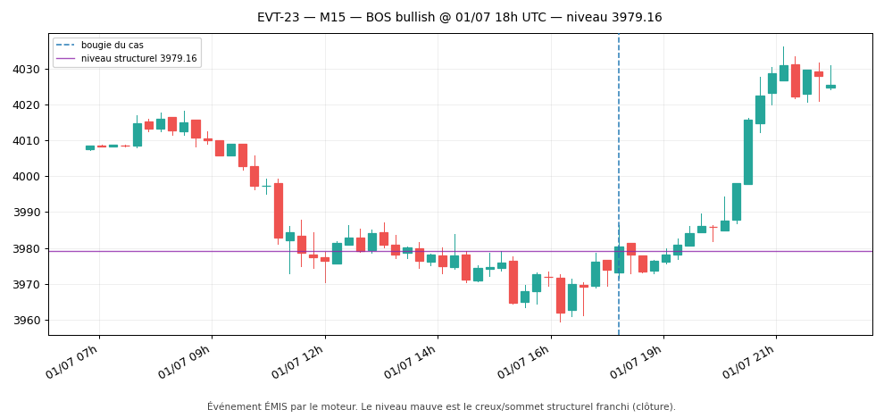

### EVT-24 — M15 — 2026-06-05 22:30:00+00:00
*CHOCH bearish niveau 4460.9*  
**Question : Cet événement ÉMIS est-il un vrai BOS/CHOCH ?**  
Verdict : ☐ d'accord ☐ pas d'accord ☐ incertain — Commentaire : ______

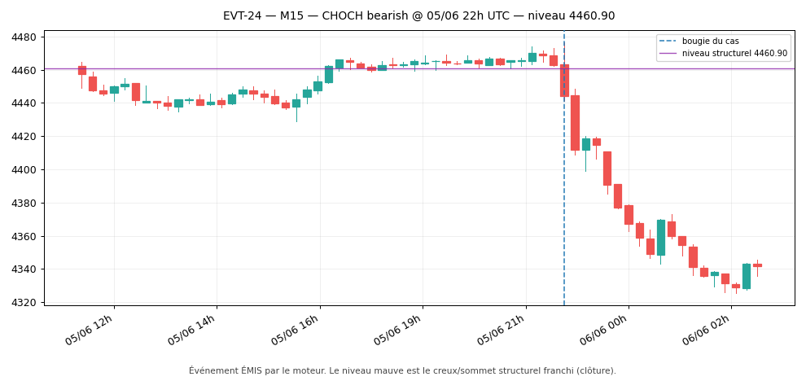

### EVT-25 — M15 — 2026-06-03 23:30:00+00:00
*BOS bearish niveau 4438.96*  
**Question : Cet événement ÉMIS est-il un vrai BOS/CHOCH ?**  
Verdict : ☐ d'accord ☐ pas d'accord ☐ incertain — Commentaire : ______

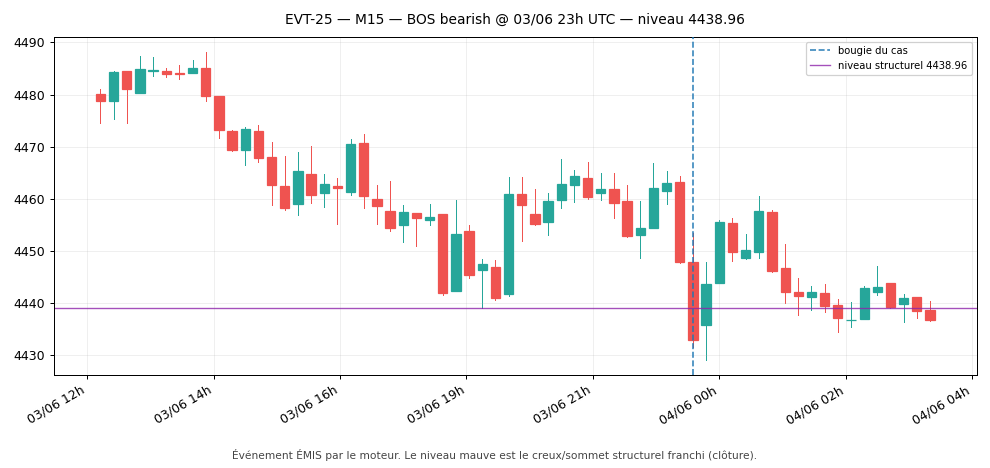

---

## Section 3B — 25 franchissements SANS événement (faux négatifs potentiels)

Pour chacun : le moteur a-t-il eu raison de NE PAS émettre ?

### NON-01 — M15 — 2026-07-08 20:15:00+00:00
*franchissement down SANS evenement — niveau deja franchi (garde anti-repetition)*  
**Question : Le moteur a-t-il eu raison de NE PAS emettre ici ?**  
Verdict : ☐ d'accord ☐ pas d'accord ☐ incertain — Commentaire : ______

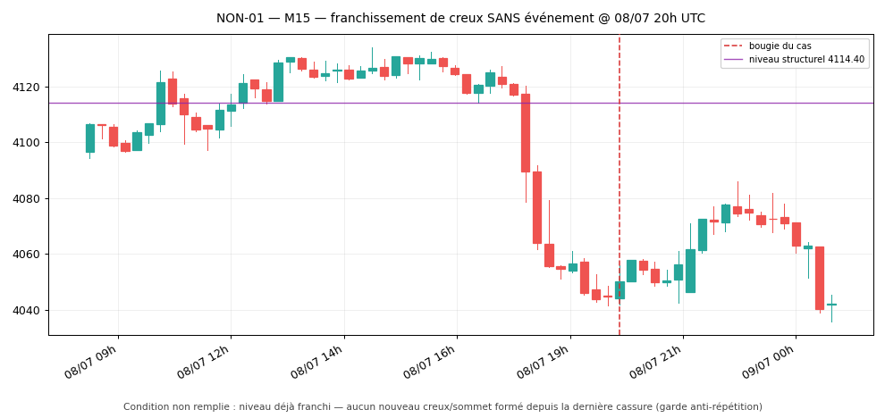

### NON-02 — H1 — 2026-06-15 21:00:00+00:00
*franchissement up SANS evenement — franchi en meche, cloture en deca*  
**Question : Le moteur a-t-il eu raison de NE PAS emettre ici ?**  
Verdict : ☐ d'accord ☐ pas d'accord ☐ incertain — Commentaire : ______

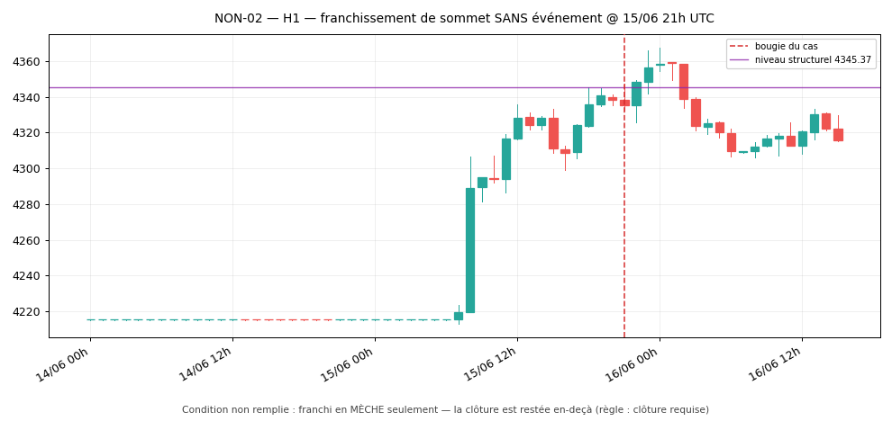

### NON-03 — M15 — 2026-06-06 02:45:00+00:00
*franchissement down SANS evenement — franchi en meche, cloture en deca*  
**Question : Le moteur a-t-il eu raison de NE PAS emettre ici ?**  
Verdict : ☐ d'accord ☐ pas d'accord ☐ incertain — Commentaire : ______

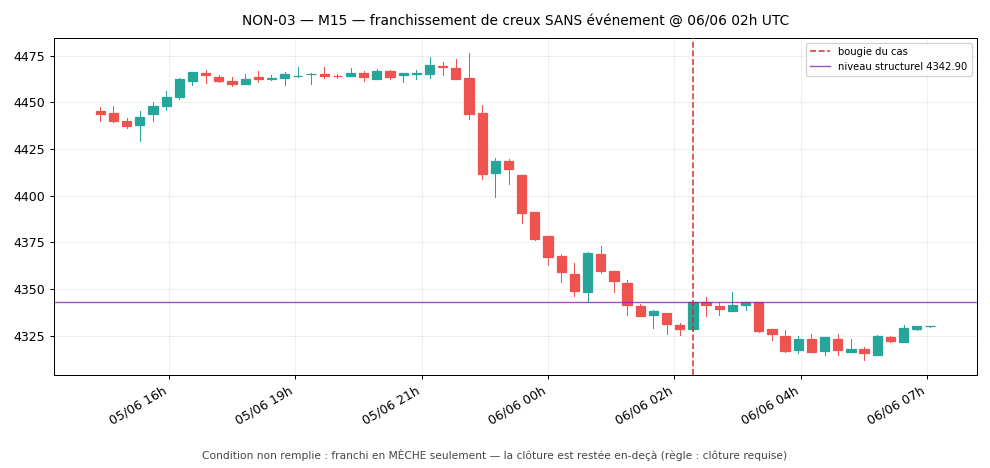

### NON-04 — M15 — 2026-07-21 16:45:00+00:00
*franchissement up SANS evenement — niveau deja franchi (garde anti-repetition)*  
**Question : Le moteur a-t-il eu raison de NE PAS emettre ici ?**  
Verdict : ☐ d'accord ☐ pas d'accord ☐ incertain — Commentaire : ______

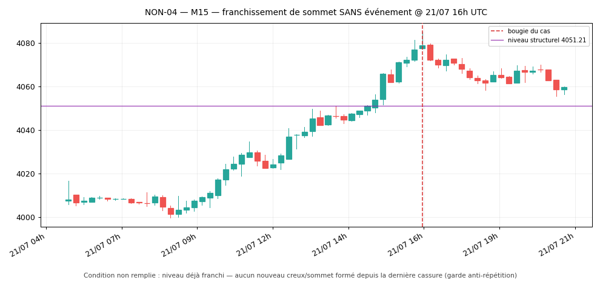

### NON-05 — M15 — 2026-06-05 13:00:00+00:00
*franchissement down SANS evenement — niveau deja franchi (garde anti-repetition)*  
**Question : Le moteur a-t-il eu raison de NE PAS emettre ici ?**  
Verdict : ☐ d'accord ☐ pas d'accord ☐ incertain — Commentaire : ______

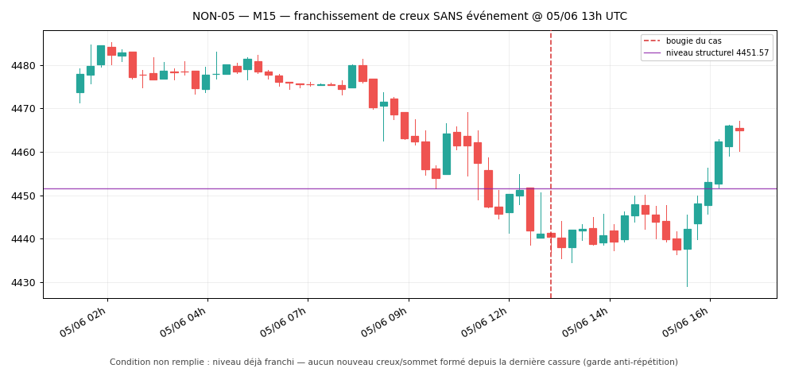

### NON-06 — M15 — 2026-06-03 20:15:00+00:00
*franchissement up SANS evenement — franchi en meche, cloture en deca*  
**Question : Le moteur a-t-il eu raison de NE PAS emettre ici ?**  
Verdict : ☐ d'accord ☐ pas d'accord ☐ incertain — Commentaire : ______

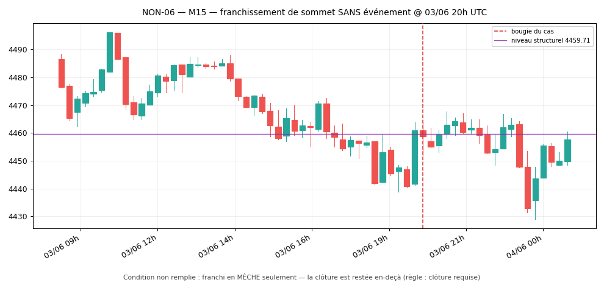

### NON-07 — M15 — 2026-06-23 13:30:00+00:00
*franchissement down SANS evenement — franchi en meche, cloture en deca*  
**Question : Le moteur a-t-il eu raison de NE PAS emettre ici ?**  
Verdict : ☐ d'accord ☐ pas d'accord ☐ incertain — Commentaire : ______

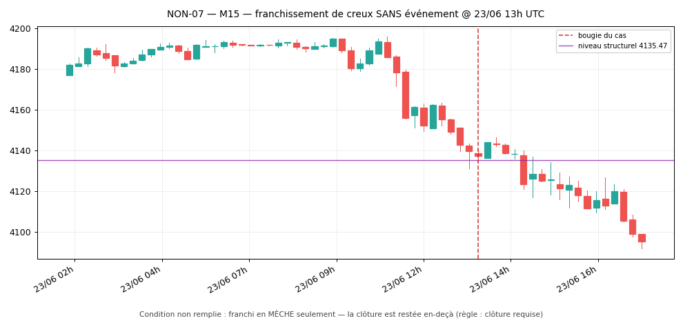

### NON-08 — M15 — 2026-06-08 22:45:00+00:00
*franchissement up SANS evenement — niveau deja franchi (garde anti-repetition)*  
**Question : Le moteur a-t-il eu raison de NE PAS emettre ici ?**  
Verdict : ☐ d'accord ☐ pas d'accord ☐ incertain — Commentaire : ______

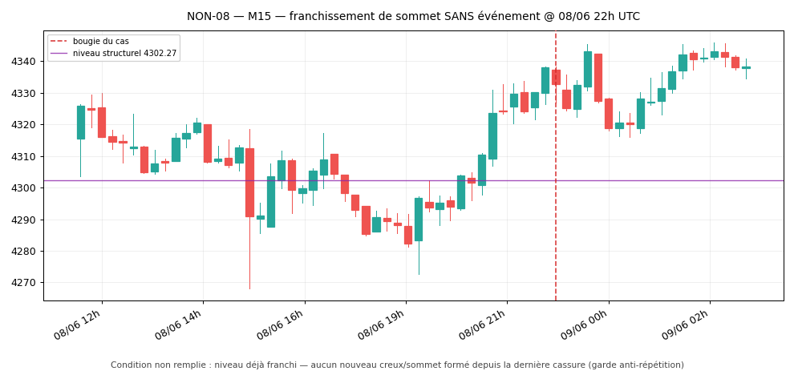

### NON-09 — M15 — 2026-06-27 04:15:00+00:00
*franchissement down SANS evenement — niveau deja franchi (garde anti-repetition)*  
**Question : Le moteur a-t-il eu raison de NE PAS emettre ici ?**  
Verdict : ☐ d'accord ☐ pas d'accord ☐ incertain — Commentaire : ______

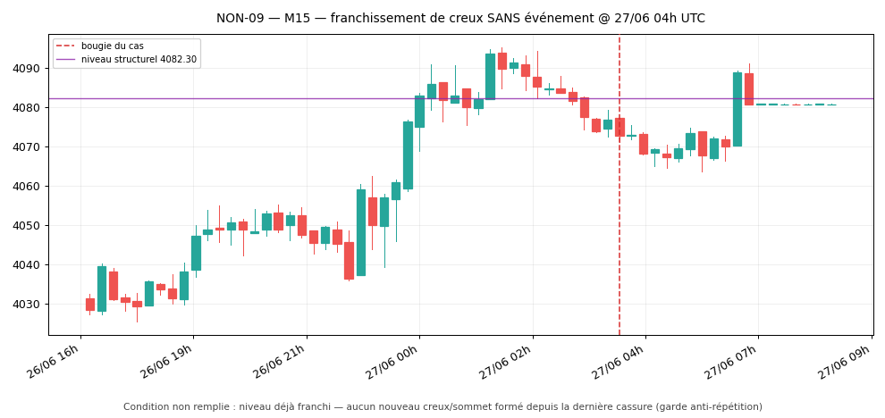

### NON-10 — M15 — 2026-07-09 23:45:00+00:00
*franchissement up SANS evenement — franchi en meche, cloture en deca*  
**Question : Le moteur a-t-il eu raison de NE PAS emettre ici ?**  
Verdict : ☐ d'accord ☐ pas d'accord ☐ incertain — Commentaire : ______

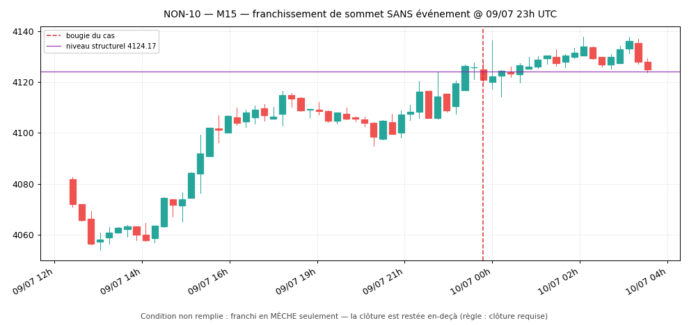

### NON-11 — M15 — 2026-06-01 13:45:00+00:00
*franchissement down SANS evenement — franchi en meche, cloture en deca*  
**Question : Le moteur a-t-il eu raison de NE PAS emettre ici ?**  
Verdict : ☐ d'accord ☐ pas d'accord ☐ incertain — Commentaire : ______

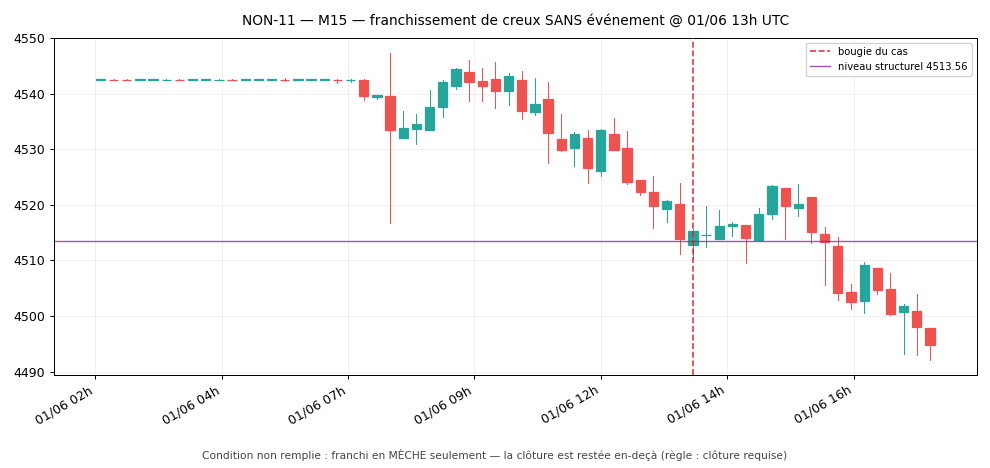

### NON-12 — M15 — 2026-07-18 01:30:00+00:00
*franchissement up SANS evenement — niveau deja franchi (garde anti-repetition)*  
**Question : Le moteur a-t-il eu raison de NE PAS emettre ici ?**  
Verdict : ☐ d'accord ☐ pas d'accord ☐ incertain — Commentaire : ______

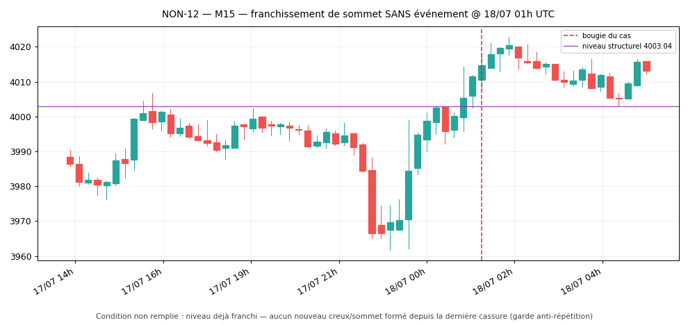

### NON-13 — H1 — 2026-06-11 07:00:00+00:00
*franchissement down SANS evenement — niveau deja franchi (garde anti-repetition)*  
**Question : Le moteur a-t-il eu raison de NE PAS emettre ici ?**  
Verdict : ☐ d'accord ☐ pas d'accord ☐ incertain — Commentaire : ______

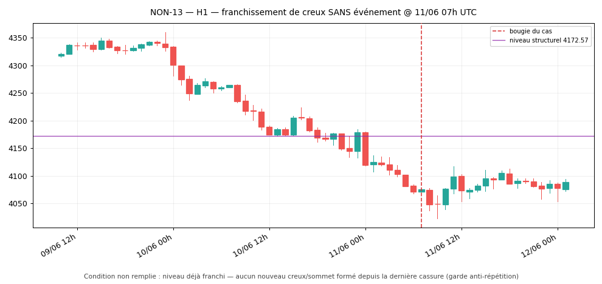

### NON-14 — M15 — 2026-07-22 04:15:00+00:00
*franchissement up SANS evenement — franchi en meche, cloture en deca*  
**Question : Le moteur a-t-il eu raison de NE PAS emettre ici ?**  
Verdict : ☐ d'accord ☐ pas d'accord ☐ incertain — Commentaire : ______

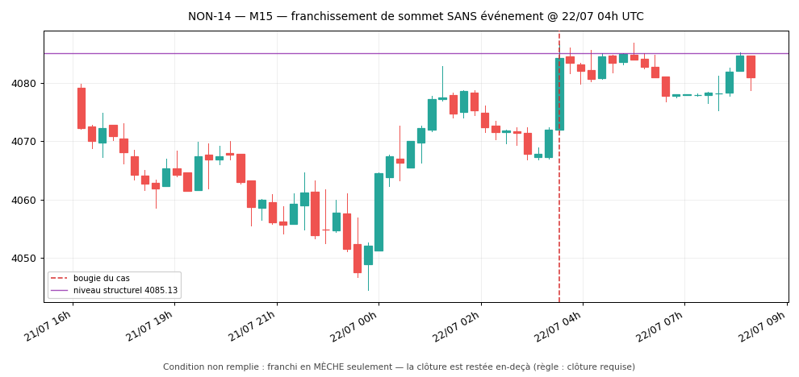

### NON-15 — M15 — 2026-06-08 08:00:00+00:00
*franchissement down SANS evenement — franchi en meche, cloture en deca*  
**Question : Le moteur a-t-il eu raison de NE PAS emettre ici ?**  
Verdict : ☐ d'accord ☐ pas d'accord ☐ incertain — Commentaire : ______

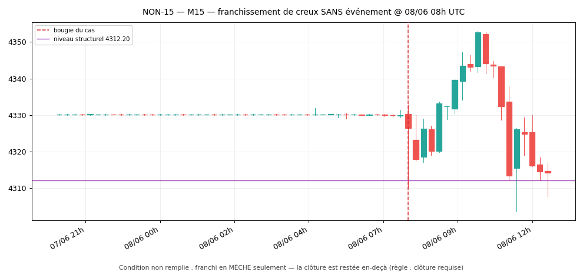

### NON-16 — H1 — 2026-07-22 12:00:00+00:00
*franchissement up SANS evenement — niveau deja franchi (garde anti-repetition)*  
**Question : Le moteur a-t-il eu raison de NE PAS emettre ici ?**  
Verdict : ☐ d'accord ☐ pas d'accord ☐ incertain — Commentaire : ______

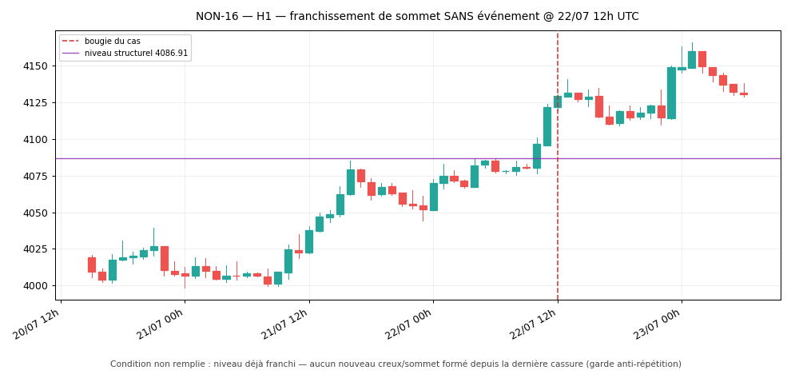

### NON-17 — H1 — 2026-06-06 02:00:00+00:00
*franchissement down SANS evenement — niveau deja franchi (garde anti-repetition)*  
**Question : Le moteur a-t-il eu raison de NE PAS emettre ici ?**  
Verdict : ☐ d'accord ☐ pas d'accord ☐ incertain — Commentaire : ______

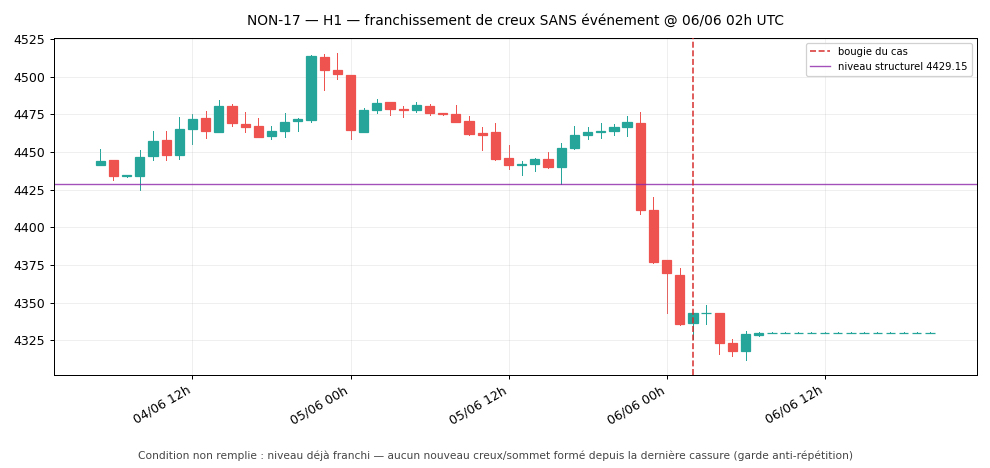

### NON-18 — H1 — 2026-07-02 00:00:00+00:00
*franchissement up SANS evenement — franchi en meche, cloture en deca*  
**Question : Le moteur a-t-il eu raison de NE PAS emettre ici ?**  
Verdict : ☐ d'accord ☐ pas d'accord ☐ incertain — Commentaire : ______

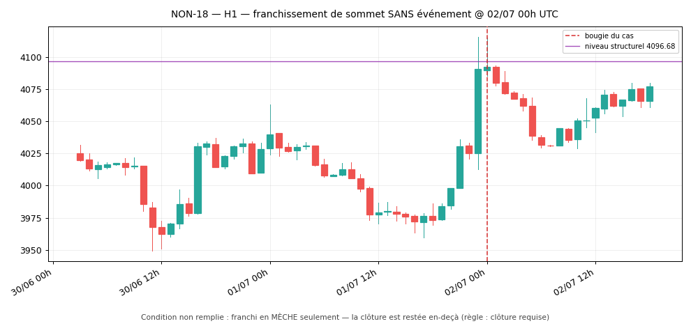

### NON-19 — M15 — 2026-07-13 14:15:00+00:00
*franchissement down SANS evenement — franchi en meche, cloture en deca*  
**Question : Le moteur a-t-il eu raison de NE PAS emettre ici ?**  
Verdict : ☐ d'accord ☐ pas d'accord ☐ incertain — Commentaire : ______

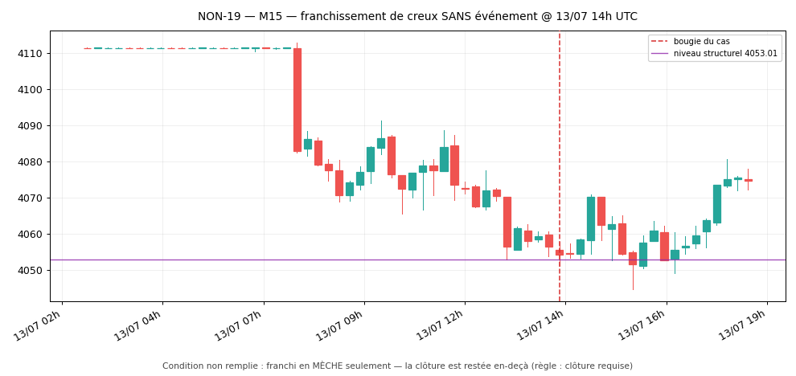

### NON-20 — M15 — 2026-06-22 11:00:00+00:00
*franchissement up SANS evenement — niveau deja franchi (garde anti-repetition)*  
**Question : Le moteur a-t-il eu raison de NE PAS emettre ici ?**  
Verdict : ☐ d'accord ☐ pas d'accord ☐ incertain — Commentaire : ______

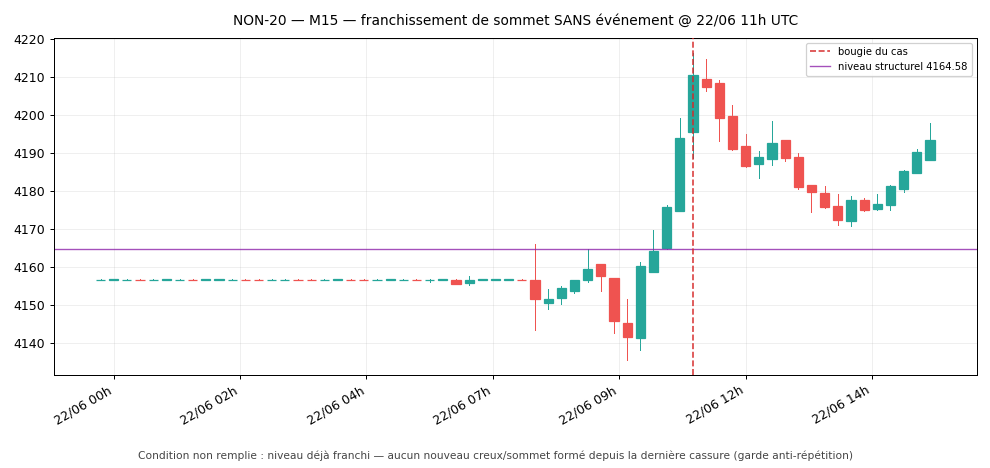

### NON-21 — M15 — 2026-06-05 22:45:00+00:00
*franchissement down SANS evenement — niveau deja franchi (garde anti-repetition)*  
**Question : Le moteur a-t-il eu raison de NE PAS emettre ici ?**  
Verdict : ☐ d'accord ☐ pas d'accord ☐ incertain — Commentaire : ______

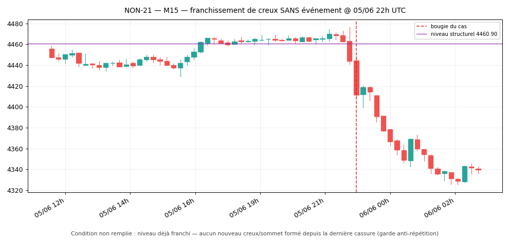

### NON-22 — M15 — 2026-07-10 00:00:00+00:00
*franchissement up SANS evenement — franchi en meche, cloture en deca*  
**Question : Le moteur a-t-il eu raison de NE PAS emettre ici ?**  
Verdict : ☐ d'accord ☐ pas d'accord ☐ incertain — Commentaire : ______

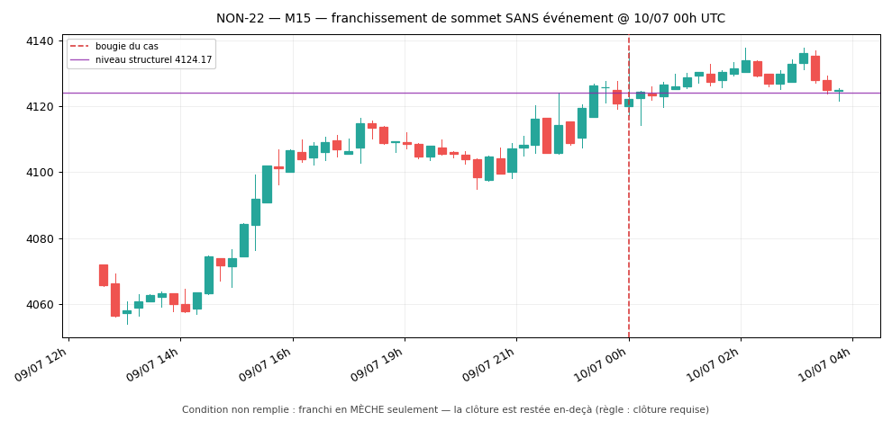

### NON-23 — M15 — 2026-07-13 16:00:00+00:00
*franchissement down SANS evenement — franchi en meche, cloture en deca*  
**Question : Le moteur a-t-il eu raison de NE PAS emettre ici ?**  
Verdict : ☐ d'accord ☐ pas d'accord ☐ incertain — Commentaire : ______

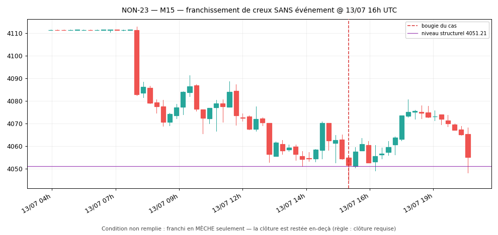

### NON-24 — M15 — 2026-07-03 11:30:00+00:00
*franchissement up SANS evenement — niveau deja franchi (garde anti-repetition)*  
**Question : Le moteur a-t-il eu raison de NE PAS emettre ici ?**  
Verdict : ☐ d'accord ☐ pas d'accord ☐ incertain — Commentaire : ______

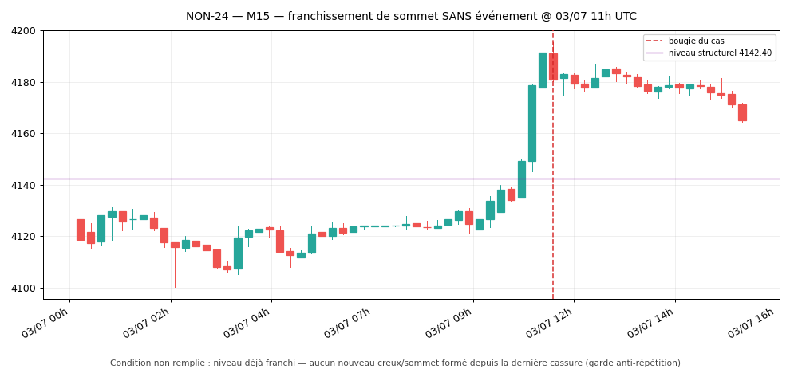

### NON-25 — H1 — 2026-07-13 16:00:00+00:00
*franchissement down SANS evenement — niveau deja franchi (garde anti-repetition)*  
**Question : Le moteur a-t-il eu raison de NE PAS emettre ici ?**  
Verdict : ☐ d'accord ☐ pas d'accord ☐ incertain — Commentaire : ______

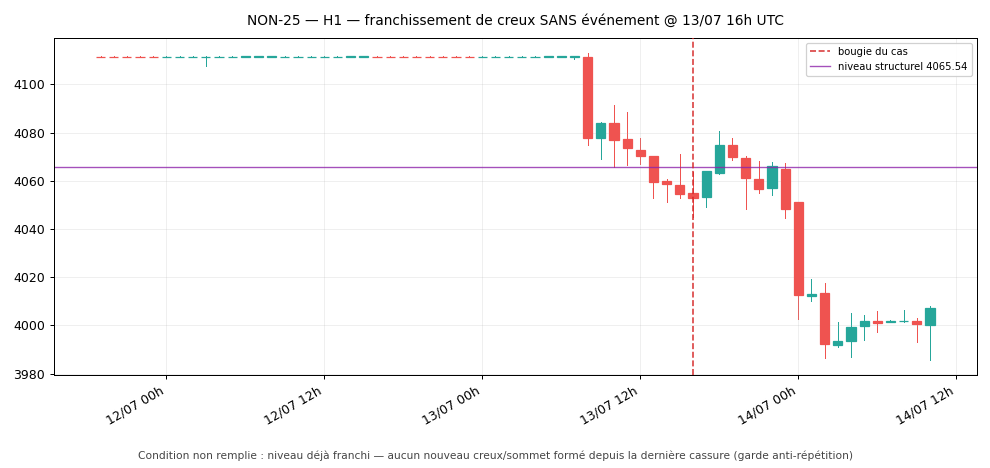

---

## Section 8 — 15 événements ajoutés en mode « mèche »

Pour chacun : vrai événement manquant, ou bruit qu'on a raison d'écarter ?

### EXTRA-01 — H1 — 2026-07-07 03:00:00+00:00
*bullish niveau 4160.63 (emis seulement en mode meche)*  
**Question : Cet evenement manquant est-il un vrai evenement ou du bruit ?**  
Verdict : ☐ d'accord ☐ pas d'accord ☐ incertain — Commentaire : ______

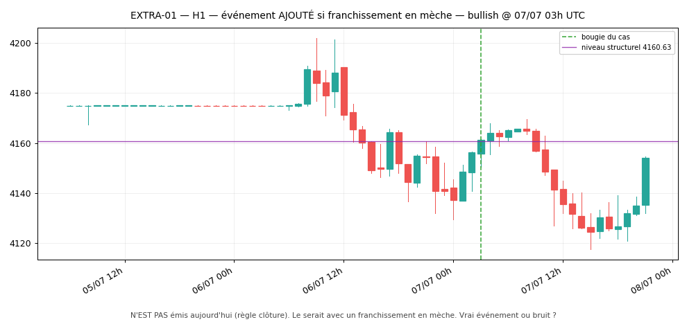

### EXTRA-02 — M15 — 2026-07-21 12:30:00+00:00
*bullish niveau 4034.86 (emis seulement en mode meche)*  
**Question : Cet evenement manquant est-il un vrai evenement ou du bruit ?**  
Verdict : ☐ d'accord ☐ pas d'accord ☐ incertain — Commentaire : ______

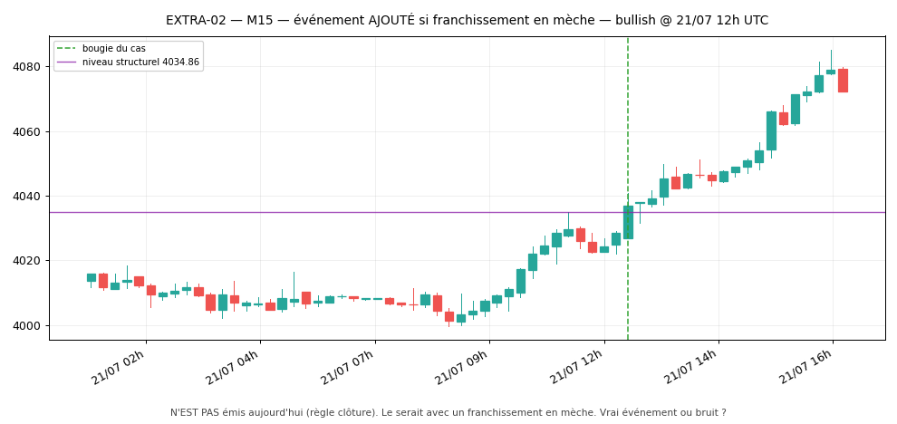

### EXTRA-03 — H1 — 2026-07-09 04:00:00+00:00
*bullish niveau 4085.91 (emis seulement en mode meche)*  
**Question : Cet evenement manquant est-il un vrai evenement ou du bruit ?**  
Verdict : ☐ d'accord ☐ pas d'accord ☐ incertain — Commentaire : ______

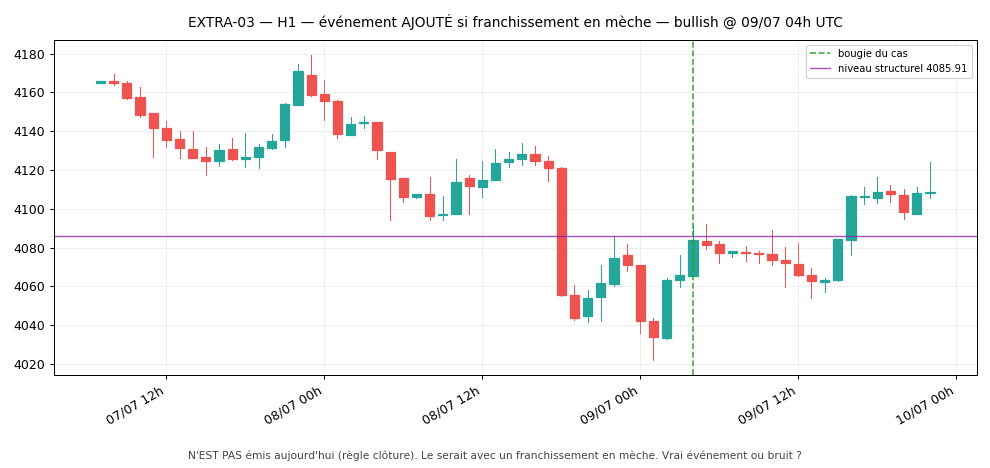

### EXTRA-04 — M15 — 2026-06-01 14:45:00+00:00
*bearish niveau 4510.4 (emis seulement en mode meche)*  
**Question : Cet evenement manquant est-il un vrai evenement ou du bruit ?**  
Verdict : ☐ d'accord ☐ pas d'accord ☐ incertain — Commentaire : ______

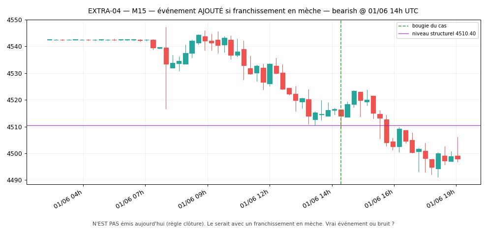

### EXTRA-05 — H1 — 2026-07-10 23:00:00+00:00
*bearish niveau 4094.84 (emis seulement en mode meche)*  
**Question : Cet evenement manquant est-il un vrai evenement ou du bruit ?**  
Verdict : ☐ d'accord ☐ pas d'accord ☐ incertain — Commentaire : ______

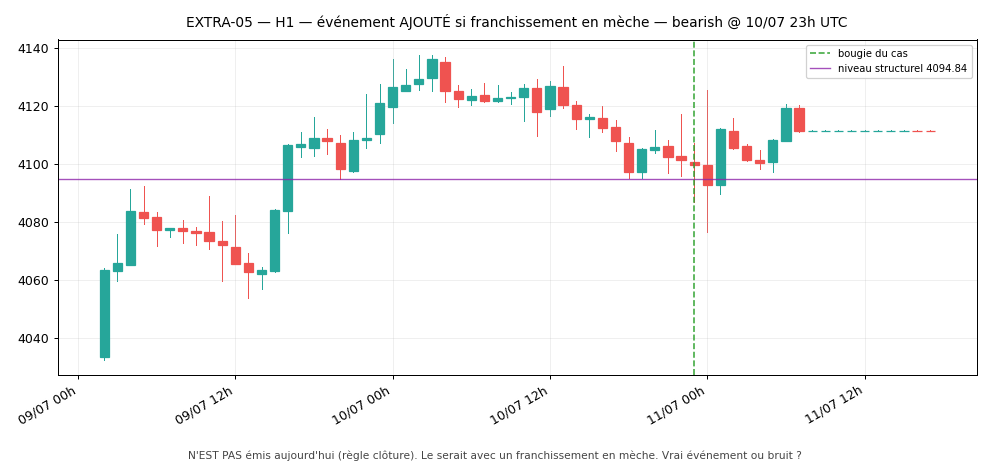

### EXTRA-06 — M15 — 2026-06-09 02:30:00+00:00
*bullish niveau 4345.38 (emis seulement en mode meche)*  
**Question : Cet evenement manquant est-il un vrai evenement ou du bruit ?**  
Verdict : ☐ d'accord ☐ pas d'accord ☐ incertain — Commentaire : ______

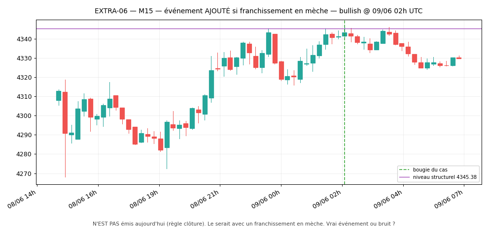

### EXTRA-07 — H1 — 2026-07-16 22:00:00+00:00
*bearish niveau 4012.55 (emis seulement en mode meche)*  
**Question : Cet evenement manquant est-il un vrai evenement ou du bruit ?**  
Verdict : ☐ d'accord ☐ pas d'accord ☐ incertain — Commentaire : ______

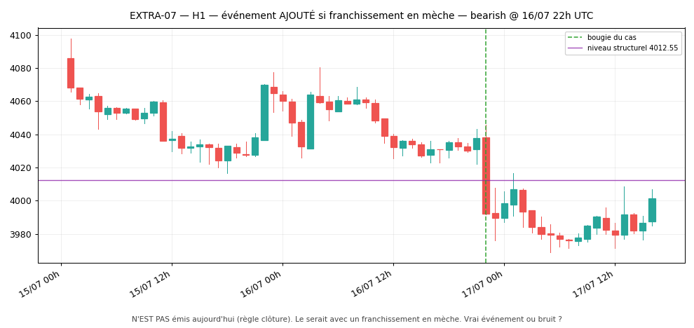

### EXTRA-08 — M15 — 2026-07-23 03:15:00+00:00
*bearish niveau 4145.12 (emis seulement en mode meche)*  
**Question : Cet evenement manquant est-il un vrai evenement ou du bruit ?**  
Verdict : ☐ d'accord ☐ pas d'accord ☐ incertain — Commentaire : ______

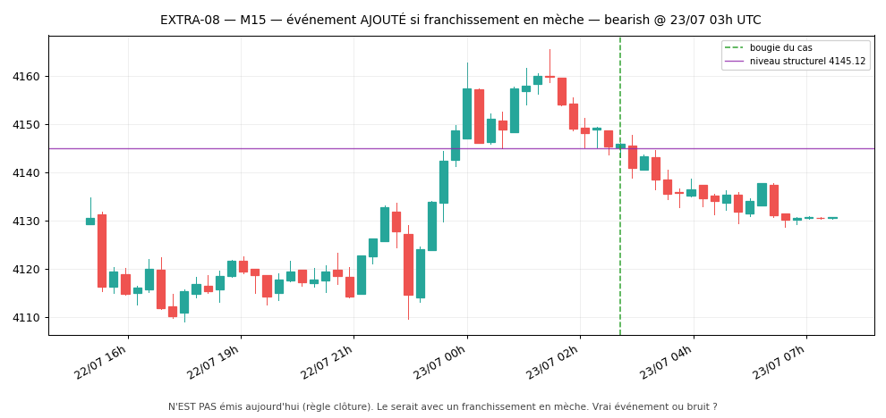

### EXTRA-09 — H1 — 2026-07-21 12:00:00+00:00
*bullish niveau 4039.42 (emis seulement en mode meche)*  
**Question : Cet evenement manquant est-il un vrai evenement ou du bruit ?**  
Verdict : ☐ d'accord ☐ pas d'accord ☐ incertain — Commentaire : ______

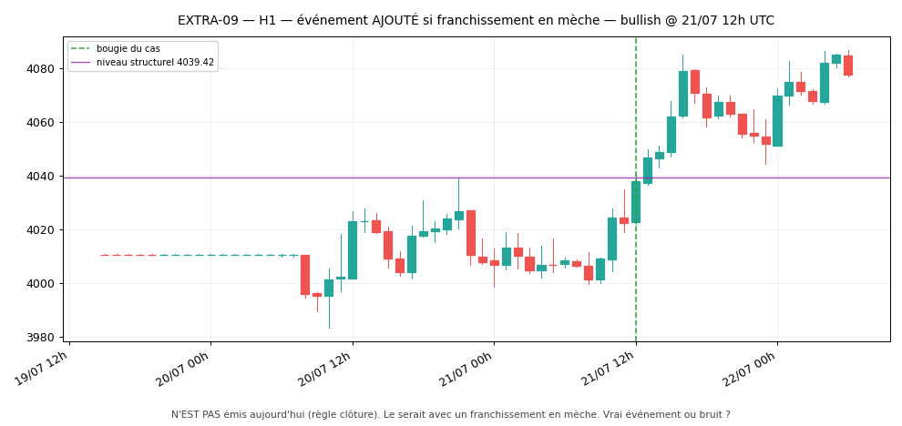

### EXTRA-10 — M15 — 2026-06-16 05:30:00+00:00
*bearish niveau 4319.09 (emis seulement en mode meche)*  
**Question : Cet evenement manquant est-il un vrai evenement ou du bruit ?**  
Verdict : ☐ d'accord ☐ pas d'accord ☐ incertain — Commentaire : ______

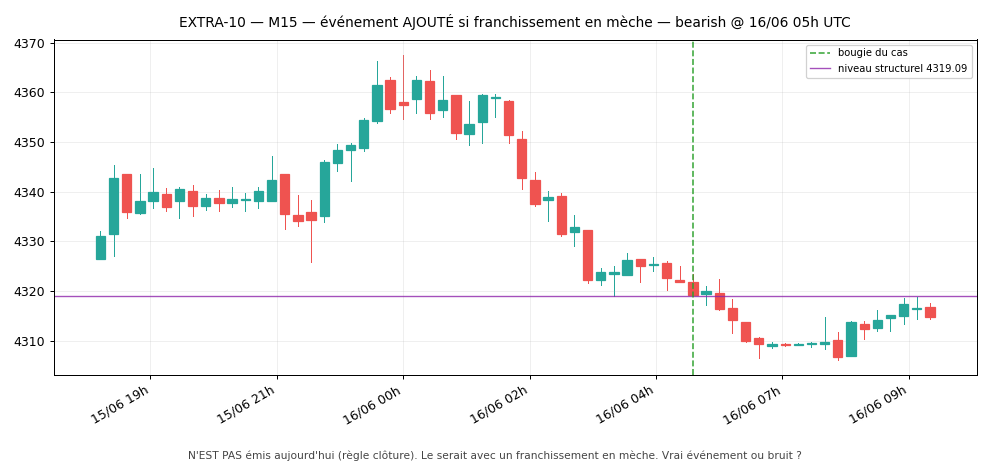

### EXTRA-11 — H1 — 2026-07-07 11:00:00+00:00
*bearish niveau 4129.33 (emis seulement en mode meche)*  
**Question : Cet evenement manquant est-il un vrai evenement ou du bruit ?**  
Verdict : ☐ d'accord ☐ pas d'accord ☐ incertain — Commentaire : ______

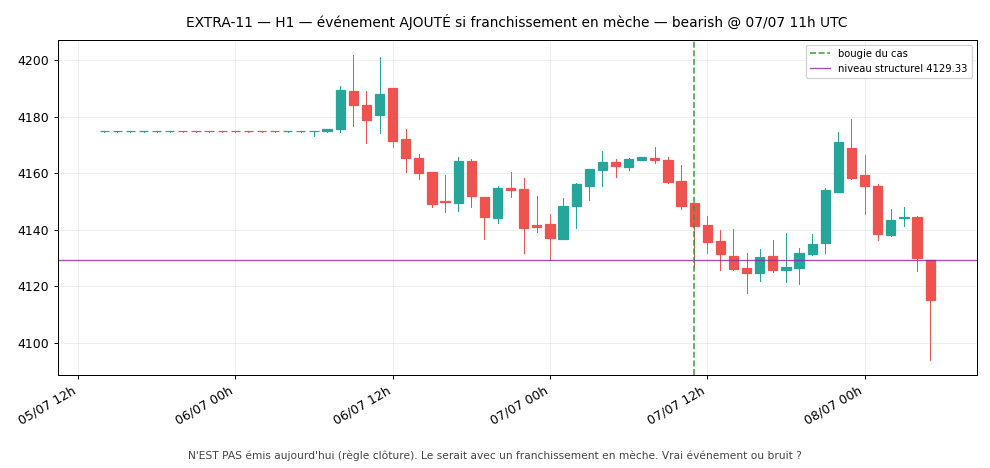

### EXTRA-12 — M15 — 2026-07-01 12:00:00+00:00
*bearish niveau 3972.92 (emis seulement en mode meche)*  
**Question : Cet evenement manquant est-il un vrai evenement ou du bruit ?**  
Verdict : ☐ d'accord ☐ pas d'accord ☐ incertain — Commentaire : ______

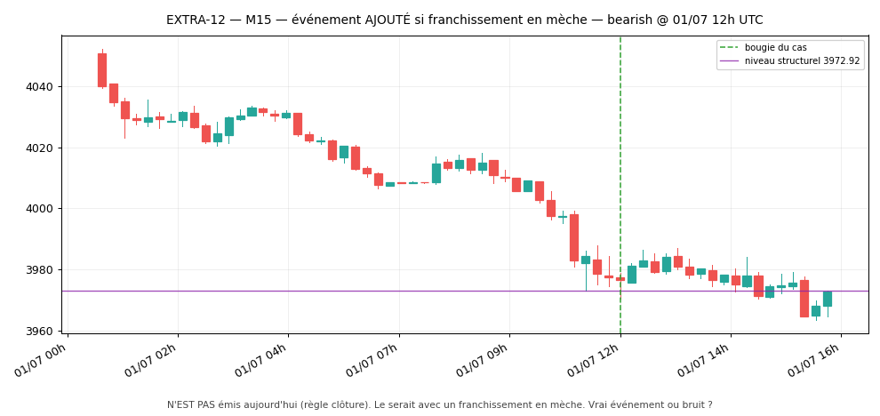

### EXTRA-13 — H1 — 2026-07-27 08:00:00+00:00
*bearish niveau 4022.09 (emis seulement en mode meche)*  
**Question : Cet evenement manquant est-il un vrai evenement ou du bruit ?**  
Verdict : ☐ d'accord ☐ pas d'accord ☐ incertain — Commentaire : ______

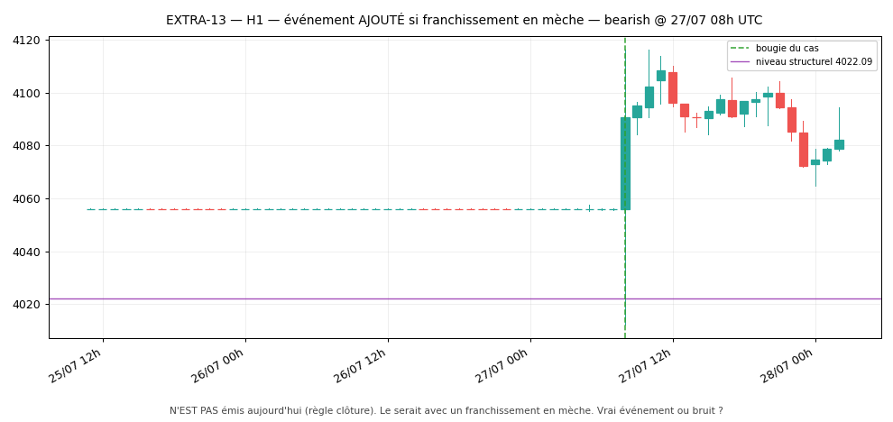

### EXTRA-14 — M15 — 2026-06-23 16:00:00+00:00
*bearish niveau 4116.92 (emis seulement en mode meche)*  
**Question : Cet evenement manquant est-il un vrai evenement ou du bruit ?**  
Verdict : ☐ d'accord ☐ pas d'accord ☐ incertain — Commentaire : ______

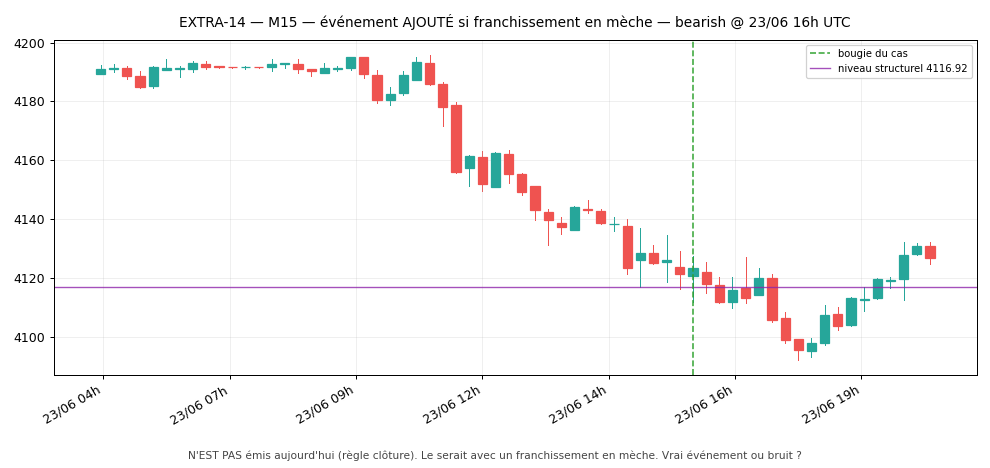

### EXTRA-15 — H1 — 2026-06-08 11:00:00+00:00
*bearish niveau 4309.97 (emis seulement en mode meche)*  
**Question : Cet evenement manquant est-il un vrai evenement ou du bruit ?**  
Verdict : ☐ d'accord ☐ pas d'accord ☐ incertain — Commentaire : ______

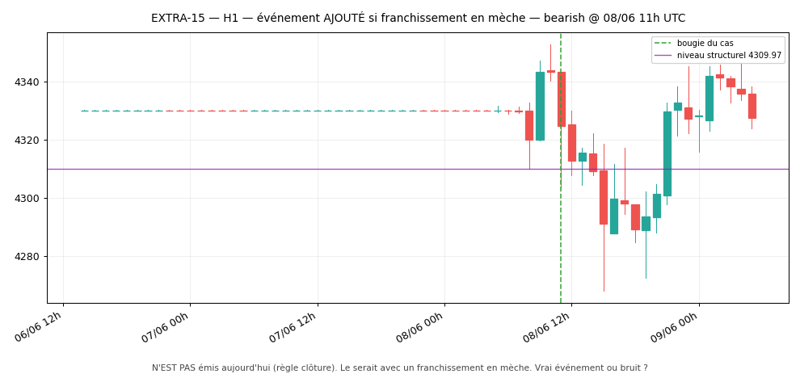

