# Eval 01 — Architecture globale & orchestration du pipeline

> Périmètre audité : `src/intelligence/main.py` (527 l.), `src/intelligence/sentinel_scanner.py` (875 l.), `config.py` (850 l.), et la chaîne d'appels inter-modules (confluence_detector, llm_narrative_engine, semantic_cache, data_providers, signal_store, notifiers, circuit_breaker, api/app.py).
>
> Date : 2026-04-24 · Branch : `main` · Git snapshot : 632e9dd + uncommitted Sprint 2 work.

---

## 1. Cartographie des dépendances

### 1.1 Diagramme d'orchestration

```mermaid
flowchart TD
    subgraph Process["Process unique (python -m src.intelligence.main)"]

        subgraph MainThread["Main thread — uvicorn.run (bloquant)"]
            API[FastAPI app<br/>signals / state / health / admin / narratives / dashboard / operator / prometheus]
        end

        subgraph ScannerThread["Daemon thread: sentinel-scanner"]
            Loop["SentinelScanner._run_loop<br/>while running: _scan_once(); time.sleep(60)"]
            ScanOnce["_scan_once()"]
            Loop --> ScanOnce
        end

        subgraph Watchdog["Daemon thread: sentinel-watchdog"]
            WD["_watchdog()<br/>vérifie scanner_thread toutes les 30s"]
        end

        subgraph Shared["Shared state (pas de lock explicite)"]
            AppState[AppState dataclass]
            SM[SignalStateMachine per symbol]
            Stats[scanner stats dict]
        end

        %% Scanner pipeline
        ScanOnce --> DP[DataProvider.get_ohlcv]
        DP --> CSV[(CSV file + mtime cache)]
        DP --> MT5[(MT5 socket)]
        ScanOnce --> DQ[validate_ohlcv / DataQualityError]
        ScanOnce --> SMC[SmartMoneyEngine.analyze<br/>200 bars × pandas]
        ScanOnce --> RG[MarketRegimeAgent.analyze<br/>HMM inference]
        ScanOnce --> NW[NewsAnalysisAgent<br/>evaluate_news_impact]
        ScanOnce --> VF[VolatilityForecaster.forecast<br/>HAR / LGBM / hybrid]
        ScanOnce --> CD[ConfluenceDetector.analyze]
        ScanOnce --> SMStep[SignalStateMachine.on_bar]
        ScanOnce --> CK[SemanticCache.get/put<br/>SQLite WAL]
        ScanOnce --> LLM[LLMNarrativeEngine / TemplateNarrativeEngine]
        LLM -- via CircuitBreaker --> Anthropic[[Anthropic HTTP API]]
        ScanOnce --> SS[SignalStore.publish<br/>SQLite WAL]
        ScanOnce --> NOT[Notifier.send_signal]
        NOT -- via CircuitBreaker --> TG[[Telegram Bot API]]
        NOT -- via CircuitBreaker --> DC[[Discord webhook]]

        %% Watchdog
        WD --> Stats
        WD --> NOT

        %% API reads shared state
        API --> AppState
        AppState --> SM
        AppState --> Stats
        API --> SS
        API --> LLM
    end

    style Process fill:#1a1a1a,stroke:#666
    style Shared fill:#3b2a00,stroke:#c78a00
    style ScannerThread fill:#002a3b,stroke:#00a8c7
    style MainThread fill:#003b0f,stroke:#00c74f
    style Watchdog fill:#2a002a,stroke:#c700c7
```



### 1.2 Graphe d'imports inter-modules (arêtes significatives)

```
main.py
 ├── circuit_breaker  (CircuitBreaker, CircuitState, HealthChecker)
 ├── confluence_detector (ConfluenceDetector)
 ├── llm_narrative_engine (LLMNarrativeEngine, NarrativeTier)
 ├── template_narrative_engine (TemplateNarrativeEngine)
 ├── security (RateLimiter)
 ├── semantic_cache (SemanticCache)
 ├── sentinel_scanner (SentinelScanner, MultiSymbolScanner)
 ├── volatility_forecaster (InstrumentConfig, VolatilityForecaster, registry)
 ├── data_providers (CSVDataProvider, MT5DataProvider)
 ├── api.signal_store (SignalStore)
 ├── api.dependencies (AppState)
 ├── api.app (create_app) — importé retard dans build_system
 ├── delivery.telegram_notifier / delivery.discord_notifier
 ├── agents.market_regime_agent (best-effort)
 └── agents.news_analysis_agent (best-effort)

sentinel_scanner.py
 ├── circuit_breaker
 ├── confluence_detector
 ├── llm_narrative_engine
 ├── semantic_cache
 ├── signal_state_machine
 ├── state_persistence
 ├── data_quality  (import retardé dans _scan_once)
 ├── environment.strategy_features (via smc_factory closure depuis main.py)
 └── agents.events (import retardé dans _scan_once pour NewsAgent)
```

### 1.3 Couplage / cycles

- **Aucun cycle d'imports direct détecté.** Les imports retardés (`data_quality`, `api.signal_store.SignalRecord`, `agents.events`) sont placés **dans les méthodes** de `_scan_once` — cela ajoute quelques µs par bar mais évite les cycles.
- **Couplage fort "data-flow"** : `SentinelScanner` dépend de 10 collaborateurs injectés au constructeur. Testable (injection) mais `build_system` concentre toute la logique de wiring en 287 lignes procédurales — point unique de churn.
- **`config.py` est quasi-mort dans le pipeline Sentinel.** Grep sur `src/intelligence/` et `src/delivery/` : **0 import**. Seul `src/api/signal_tracker.py` l'importe — or `signal_tracker` n'est pas branché dans `build_system` (voir §2.4). Les 850 lignes de config RL sont des vestiges et polluent la compréhension.
- **Scanner ↔ API couplage implicite** via `AppState.scanner` et `scanner.state_machine` : 8 routes FastAPI lisent `request.app.state.app_state.scanner.*` sans verrou (voir §2.3).

---

## 2. Points de contention (blocking / GIL / I/O sérielle)

### 2.1 Chemin critique d'un tick "signal fired"

| Étape | Type | Latence estimée | Bloque le thread |
|---|---|---|---|
| `get_ohlcv` (CSV) | File I/O + pandas re-parse si mtime change | 5-50 ms (cache hit), 100-500 ms (cache miss) | oui |
| `get_ohlcv` (MT5) | Socket RPC | 20-200 ms | oui |
| `validate_ohlcv` | pandas | 1-5 ms | oui (GIL) |
| `SmartMoneyEngine.analyze` sur 200 bars | pandas + numpy | **20-150 ms** | oui (GIL Python majoritaire) |
| `MarketRegimeAgent.analyze` | hmmlearn Viterbi | 10-80 ms | partiel (numpy libère) |
| `NewsAgent.evaluate_news_impact` | CSV lookup + keywords | 1-20 ms | oui |
| `VolatilityForecaster.forecast` | LightGBM predict | 5-50 ms | partiel |
| `ConfluenceDetector.analyze` | arithmétique | <1 ms | oui |
| `SignalStateMachine.on_bar` | arithmétique | <1 ms | oui |
| `SemanticCache.get/put` | SQLite WAL | 1-10 ms | oui |
| **`LLMNarrativeEngine.generate_narrative`** | **HTTP Anthropic** | **800-5000 ms** (Haiku) à **2-15 s** (Sonnet cascade) | **oui, inline** |
| `SignalStore.publish` | SQLite WAL write | 2-15 ms | oui |
| **`notifier.send_signal`** | **HTTP Telegram / Discord webhook** (`requests.post`) | **200-3000 ms** | **oui, inline** |

**Total pire cas steady-state "new bar, signal fired" : 1.1 s → 8.5 s passés à bloquer le thread scanner.** Sur `MultiSymbolScanner` cette latence est **additive** : les 6 symboles sont scannés **sériellement dans la même boucle** (`scan_all_once` itère un dict), donc un signal XAUUSD avec LLM lent retarde le scan d'EURUSD/BTCUSD du même tick.

### 2.2 Producer/consumer : aucune séparation

- Aucune queue, aucun worker pool. Scanner génère + enrichit + persiste + notifie **sur le même thread**.
- Conséquence : une panne Anthropic qui fait expirer la connexion HTTP **en 30 s** (default `anthropic-python` timeout) gèle le scan suivant pendant 30 s alors que le circuit breaker est censé ouvrir après 3 échecs — le **premier** échec coûte les 30 s entières, ce qui cumulé avec le poll 60 s = 90 s de delay perçu utilisateur.
- La notification est en `requests.post` synchrone (Discord) ou `python-telegram-bot` en mode sync (`self._bot.send_message` sans `asyncio.run`). Aucun fallback queue → message perdu en cas de 429 rate limit Telegram (30 msg/s global bot, 1 msg/s par chat).

### 2.3 Concurrence main thread (uvicorn) ↔ daemon thread (scanner)

- `AppState.scanner` est partagé en lecture. Le scanner mute `_last_bar_ts`, `_bars_scanned`, `_state_transitions_emitted`, et **l'instance `SignalStateMachine` entière** sans lock.
- 8 routes API (`state.py`, `health.py`, `narratives.py`, `admin.py`, `operator.py`, `dashboard.py`, `prometheus.py`, `signals.py`) lisent ces attributs.
- Risque : **torn read** sur `state_machine.snapshot()` qui renvoie un `dataclass` composite (state + direction + bars_in_state + bars_remaining + confirmation_progress). Si la route FastAPI lit à mi-update du state machine côté scanner, elle peut renvoyer un snapshot incohérent (ex : state=BUY mais direction=None).
- Aucune `threading.Lock` dans `sentinel_scanner.py`. La mécanique Python du GIL rend les assignations individuelles atomiques, mais pas les **snapshots multi-champs**.

### 2.4 Ressources "mortes" qui brouillent l'architecture

| Artefact | Statut | Impact |
|---|---|---|
| `config.py` 850 lignes (RL bot legacy : PPO, GARCH, drawdown limits) | **Non importé par le pipeline Sentinel.** Grep prouve 0 usage dans `src/intelligence/`, `src/delivery/`. | Charge cognitive, risque qu'un dev touche `HISTORICAL_DATA_FILE` en pensant que c'est le data path prod. |
| `src/api/signal_tracker.py` | Importe `config` ; **non wiré dans `create_app`** (signature `signal_tracker=None`). | Code mort ou future-feature ; à documenter ou supprimer. |
| `app_state.kill_switch`, `var_engine`, `live_risk_manager`, `key_store`, `hmac_manager`, `tier_manager` dans `create_app` | Tous optionnels et **tous passés `None` depuis `main.build_system`**. | Surface inutile ; soit câbler, soit retirer. |
| `TESTING_MODE` par défaut à `1` | Auth bypass par défaut. | Si Railway déploie avec `SENTINEL_TESTING_MODE` non défini → INSTITUTIONAL gratuit pour le monde. Voir Prompt 11, mais flag ici aussi car c'est de l'orchestration. |
| `NARRATIVE_MODE=template` par défaut | LLM désactivé par défaut. | **Rend l'ensemble du circuit breaker LLM inerte** ; `LLMNarrativeEngine` n'est même pas instancié. Donc en prod par défaut, le différentiateur N°1 (narration IA) est **off**. |

---

## 3. Résilience — scénarios de panne

| Scénario | Détection | Recovery | Impact produit | Note |
|---|---|---|---|---|
| CSV introuvable | `CSVDataProvider._load_csv` → `FileNotFoundError` | Propagé, `_scan_once` `except Exception` → `_errors++`, sleep 60 s, retry | Silence complet côté abonné | 4/10 |
| MT5 disconnect | Internal `ensure_connected` + reconnect | Auto-reconnect built-in | Gap de quelques bars | 7/10 |
| Data quality gate fail (strict=True) | `DataQualityError` levée | Bar dropped, `_errors++` | Pas de signal ce bar | 7/10 |
| Anthropic timeout (LLM) | `CircuitBreaker.call` wrappe `generate_narrative` | Circuit ouvre après 3 échecs, recovery 60 s ; fallback = `{"summary": "LONG XAUUSD — score 78", "fallback": true}` | Narrative dégradée → UX pauvre mais signal posté | 8/10 |
| Telegram rate limit 429 | `CircuitBreaker` (threshold 5, recovery 120 s) | Circuit ouvre, signal persisté mais **pas notifié** | Signal "perdu" côté abonné | **4/10** (pas de DLQ / retry) |
| Discord 5xx | Idem Telegram | Idem | Idem | 4/10 |
| Scanner thread crash | Try/except dans `_run_scanner` + watchdog ping Discord | Thread **non relancé**. Watchdog fire une alerte unique puis silence. Process reste up. | Zéro signal jusqu'au redémarrage manuel | **3/10** |
| State machine corrompue (bug arithmétique) | `_step_state_machine` try/except | Bar skipped | OK mais état interne divergé | 6/10 |
| SQLite lock contention | Non géré explicitement | `sqlite3` timeout=30 s | En multi-tenant → timeout errors | 5/10 |
| SIGTERM pendant `time.sleep(60)` | `shutdown()` pose `_running=False` | **Le sleep de 60 s ne se réveille pas.** Le thread dort jusqu'à expiration, d'où shutdown latency jusqu'à 60 s. | OK sur SIGTERM court-circuité par kubelet après 30 s → state potentiellement non persisté | **4/10** (devrait utiliser `Event.wait(60)` comme le watchdog) |
| uvicorn crash (API) | Try/except dans `main()` + Discord ping | Process exit 1 → attente orchestrateur | Downtime global | 6/10 (si Railway auto-restart) |
| `_calibrate_system` exception | Try/except per-symbol, loggé warning | Forecaster reste non-calibré, fallback ATR naïf | Score volatilité dégradé silencieux | 5/10 |

### 3.1 SPOF (Single Point of Failure)

| Composant | SPOF ? | Mitigation actuelle | Mitigation recommandée |
|---|---|---|---|
| Process Python unique | **OUI** | Aucune | 2 replicas derrière un leader election (Redis lock) ou orchestrator level (Railway n'a pas de multi-instance lead) |
| DataProvider CSV | **OUI** (1 seule source) | File mtime cache | Fallback provider en cascade (MT5 → Dukascopy download → CSV cache) |
| Scanner thread | **OUI** | Watchdog alert, pas de restart | Auto-restart dans le watchdog, max N restarts sinon exit |
| SQLite SignalStore | **OUI** | WAL mode | Postgres migration (Neon/Supabase) — voir Eval 12 |
| SQLite SemanticCache | **OUI** | WAL mode | Redis / KeyDB |
| SQLite state_persistence | **OUI** | Atomic write + staleness guard | OK tant que single-instance |
| Notifier (1 webhook) | **OUI** | Circuit breaker ouvre | Dual-channel fan-out (Telegram + Discord + email) avec dedup par `signal_id` |
| Anthropic API | **OUI** | Circuit breaker, fallback template | Multi-provider (OpenAI, Gemini, local Llama pour Haiku tier) |

---

## 4. Budget temps : cold-start & steady-state

### 4.1 Cold-start (`build_system` → premier signal)

| Phase | Durée estimée | Dominante |
|---|---|---|
| Imports top-level (`pandas`, `anthropic`, `lightgbm`, `hmmlearn`, `fastapi`, `uvicorn`) | 2-4 s | Python import machinery |
| `build_system` wiring (sans calibration) | 0.3-1 s | SQLite open × 2, Anthropic client init |
| `_calibrate_system` (1 symbol, `VOL_MODE=har`) | 0.5-2 s | HAR-RV OLS fit sur 10 000 bars |
| `_calibrate_system` (1 symbol, `VOL_MODE=lgbm`) | 5-30 s | LightGBM fit avec 3-fold CV |
| `_calibrate_system` (1 symbol, `VOL_MODE=hybrid`) | 10-40 s | HAR + LGBM résidus |
| `_calibrate_system` (6 symbols hybrid, **sériel**) | **60-240 s** | Pas de parallélisme |
| `uvicorn.run` bind + ready | 0.2-0.5 s | |
| Wait first 15-min bar close | 0 à **15 min** | Dépend du timing de démarrage |
| **Total cold-start → ready state** | **3-245 s** | Calibration domine si hybrid multi-symbol |
| **Total cold-start → first signal** | **ready state + 0-15 min** | M15 timeframe |

**Recommandation** : calibration en parallèle par symbol via `concurrent.futures.ThreadPoolExecutor` → 6 symbols en 10-40 s au lieu de 60-240 s. Gain : **4-6×**.

### 4.2 Steady-state (tick → signal publié)

| Cas | Latence scanner interne | Latence perçue abonné |
|---|---|---|
| Idle bar (même timestamp) | 5-30 ms | N/A |
| New bar, no signal (score < 75) | 50-250 ms | N/A |
| New bar, signal, `NARRATIVE_MODE=template`, Discord notifier | 60-300 ms + 200-800 ms HTTP webhook ≈ **0.3-1.1 s** | bar_close + uniform(0, 60 s poll) + 0.3-1.1 s ≈ **0.3-61 s** |
| New bar, signal, `NARRATIVE_MODE=llm` Haiku only | + 800-2000 ms LLM ≈ **1.1-3 s** | **1.1-63 s** |
| New bar, signal, `NARRATIVE_MODE=llm` Narrator cascade (Haiku+Sonnet) | + 3000-8000 ms LLM ≈ **3.3-9 s** | **3.3-69 s** |
| New bar, signal, 6 symbols simultanés (multi-scanner sériel) | pire : 6 × 9 s = **54 s** | Le 6e symbole arrive 54 s après le 1er |

**SLO "signal dans les 30 s après la clôture du bar"** n'est atteignable de manière fiable **que si** :
1. `poll_interval ≤ 20 s` (actuellement 60 s)
2. `NARRATIVE_MODE=template` ou `NARRATIVE_MODE=llm` avec tier `VISUAL` ou `VALIDATOR` uniquement
3. Multi-scanner passe en parallèle (ThreadPoolExecutor ou asyncio)

### 4.3 Empreinte mémoire / CPU par tenant

Mesuré à l'œil depuis le code (pas d'exécution) :

| Ressource | Par symbole | 6 symboles | 1 tenant (6 symb) | 50 tenants × 6 symb |
|---|---|---|---|---|
| DataFrame lookback (200 bars × 8 colonnes × 8 bytes) | ~15 KB | 90 KB | 90 KB | 4.5 MB |
| DataFrame calibration (10 000 bars) | ~800 KB | 4.8 MB | 4.8 MB | 240 MB |
| VolatilityForecaster `har` state | ~100 KB | 600 KB | 600 KB | 30 MB |
| VolatilityForecaster `lgbm` state (tree booster) | 5-20 MB | 30-120 MB | 30-120 MB | **1.5-6 GB** |
| VolatilityForecaster `hybrid` | ~10-25 MB | 60-150 MB | 60-150 MB | **3-7.5 GB** |
| SignalStateMachine | <10 KB | 60 KB | 60 KB | 3 MB |
| SemanticCache (SQLite WAL) | disk | 10-50 MB | 10-50 MB | 500 MB-2.5 GB (si partitionné) |
| Python interpreter + imports | — | 150 MB | 150 MB | 150 MB partagé |
| **RAM total steady-state** | — | **250-450 MB** | **250-450 MB** | **5-10 GB si 1 process/tenant ; 1-2 GB si forecasters partagés** |
| CPU steady-state (poll 60 s, 6 symb, hybrid) | 1 tick/min × 250 ms = 2.5 s/min ≈ **4 % d'un core** | | 4 % | **200 % (2 cores saturés)** si sériel ; **30-50 %** si pooled |

**Coût infra par tenant (target Eval 24 < $1/mois)** : extrapolation Railway Hobby 8 GB/8 vCPU ≈ $20/mois → saturé par **2-4 tenants hybrid** en single-process. Il faut soit un refactor shared-forecaster, soit passer en `VOL_MODE=har` par défaut pour les tiers FREE/ANALYST.

---

## 5. Benchmark vs. architectures modernes

| Architecture | Applicabilité Sentinel | Verdict |
|---|---|---|
| **Event-driven (NATS JetStream / Kafka)** | Streams = `bars.XAUUSD.M15` → `signals.XAUUSD` → `notifications.telegram`. Workers isolés par domaine. Backpressure, replay, fan-out tenants. | **Pertinent à >100 tenants ou >20 symboles.** Overkill aujourd'hui (6 symbols × 1 tick/min = 0.1 msg/s). Garder en roadmap post-10-tenants. |
| **Async FastAPI + httpx + anyio** | `_scan_once` devient `async` ; `anthropic.AsyncClient`, `aiohttp` pour webhook. Un `asyncio.gather` permet `vol_forecast + regime + news` en parallèle, et LLM + notifier concurrents avec le scan du symbol suivant. | **Gain immédiat 2-3× sur tick→signal** en mode LLM cascade. Refactor ~2-3 jours (scanner + notifiers + LLM engine). **Recommandé.** |
| **Actor model (Thespian / Ray / Dramatiq)** | Un acteur par symbol, un par tenant. Ray ajoute 500 MB+ de base + complexity. | **Overkill.** Thespian plus léger mais peu communauté. Non retenu. |
| **Celery / RQ worker pool** | Worker pool dédié LLM + notifier derrière Redis. Scanner reste sync mais "fire-and-forget" sur les appels externes. | **Bon compromis medium-term.** Ajoute Redis (déjà proposé pour SemanticCache Eval 06). Refactor ~3-5 jours. |
| **Serverless (Lambda/Cloud Run par bar)** | `EventBridge` cron M15 → Lambda. Stateless, mais calibration par cold-start = trop lent pour `VOL_MODE=hybrid`. | **Inadapté.** Cold-start 60-240 s × fréquence 15 min = toujours cold. À écarter. |

### 5.1 Multi-tenant — gap analysis

| Besoin multi-tenant | État actuel | Effort pour atteindre |
|---|---|---|
| `tenant_id` sur chaque signal, cache, persistance | Aucun ; SignalStore partagé, webhook global | **5-8 j** : schéma DB, routes API, state_persistence dir tenant-scoped |
| Config par tenant (symbols, webhook, NARRATIVE_MODE) | Uniquement env vars globaux | **2-3 j** : table `tenants`, loader qui substitue `os.environ` |
| Isolation des forecasters | 1 forecaster par symbol partagé entre tenants serait idéal | **3 j** : factory singleton + verrouillage read-only post-calibration |
| Résilience par tenant | Scanner crash = tous les tenants down | **5 j** : process pool ou k8s StatefulSet par shard de tenants |
| Rate limiter par tenant API key | Rate limiter actuel = IP-based | **1-2 j** : clé composite `tenant_id+ip` |
| **Verdict multi-tenant 50 × 6 sans refactor majeur** | **NON** | **Minimum 15-20 j ing.** |

---

## 6. Diagnostic — Notes /10

| Dimension | Note | Justification |
|---|---|---|
| Propreté du wiring (injection, testabilité) | **7/10** | `build_system` est long mais toutes les deps sont injectées. Tests unit possibles grâce aux `None` par défaut. |
| Séparation producer/consumer | **3/10** | Tout sur un thread, pas de queue, LLM/notifier inline dans la boucle critique. |
| Résilience pannes externes | **6/10** | Circuit breakers présents, mais pas de DLQ/retry notifier, scanner thread non auto-relancé. |
| Observabilité | **6/10** | JSON logs, /health, watchdog. Pas de traces distribuées, pas de Prometheus branché (le router existe mais vide — voir Eval 16). |
| Scalabilité horizontale | **2/10** | Single-process, SQLite, pas de leader election, pas de tenant_id. |
| Scalabilité verticale | **5/10** | Serialisation 6 symbols bloque. Moyennable via ThreadPool + asyncio. |
| Cold-start latency | **4/10** | Jusqu'à 4 min en hybrid × 6 symbols. Calibration parallélisable trivialement. |
| Hygiène du code d'orchestration | **5/10** | `config.py` mort à 90 %, 6 paramètres `create_app` inutilisés, `TESTING_MODE=1` par défaut, `NARRATIVE_MODE=template` par défaut rend le différentiateur LLM invisible hors flag explicite. |
| **Note globale robustesse + scalabilité** | **4.5/10** | Production-ready pour 1 tenant / 1 symbol ; non-ready pour multi-tenant ou SLA sérieux. |

---

## 7. Top 5 refactors priorisés (matrice effort × impact)

| # | Refactor | Effort | Impact revenu / crédibilité | Ratio |
|---|---|---|---|---|
| 1 | **Paralléliser `MultiSymbolScanner.scan_all_once` via `concurrent.futures.ThreadPoolExecutor`** — chaque symbol scanne indépendamment, limite le blocage LLM à son propre symbol. Ajout d'un `threading.Lock` sur `SignalStateMachine` (ou une queue thread-safe de transitions). | **1-2 j** | **Élevé** : SLO 30 s tenable, 6 symbols ne se bloquent plus mutuellement | ⭐⭐⭐⭐⭐ |
| 2 | **Remplacer `time.sleep(poll_interval)` par `shutdown_event.wait(timeout=poll_interval)`** dans `_run_loop`. Persister l'état sur shutdown fonctionne déjà, mais le scanner attend actuellement jusqu'à 60 s avant de constater le `_running=False`. | **< 1 j** | **Moyen** : shutdown gracieux < 1 s au lieu de 60 s. Impact sur la qualité opérationnelle Railway / SIGTERM. | ⭐⭐⭐⭐⭐ |
| 3 | **Introduire une `NotifierQueue` (in-memory ou Redis Stream) + worker thread dédié** : le scanner push `(signal, narrative)` dans la queue et rend la main immédiatement. Le worker gère HTTP Telegram/Discord avec retry exponentiel + dedup par `signal_id`. | **3-5 j** | **Élevé** : plus de signal "perdu" sur 429, latence tick→scan next = instantanée, fondation multi-tenant | ⭐⭐⭐⭐ |
| 4 | **Supprimer `config.py` du chemin Sentinel** : garder uniquement les 20 constantes encore référencées par `signal_tracker` / `environment/`, déplacer dans un `src/config/sentinel.py` lu depuis env. Retirer les 6 paramètres morts de `create_app`. | **2 j** | **Moyen-long** : réduction charge cognitive, suppression TESTING_MODE default-on, clarification NARRATIVE_MODE | ⭐⭐⭐⭐ |
| 5 | **Paralléliser `_calibrate_system` avec `ThreadPoolExecutor`** et gater le démarrage uvicorn sur le future. Ajout d'un endpoint `/ready` distinct de `/health` pour Railway liveness. | **1 j** | **Moyen** : cold-start 4× plus rapide, meilleur déploiement bleu/vert | ⭐⭐⭐⭐ |

### 7.1 Chantiers complémentaires (hors top 5 mais à tracer)

- Ajout d'une `threading.RLock` sur `SentinelScanner.get_stats()` et `state_machine.snapshot()` — bloque les torn reads API.
- Auto-restart du scanner dans `_watchdog` avec cap (ex : 3 restarts dans 10 min sinon exit process).
- Multi-provider LLM fallback (Anthropic → Gemini Flash → template) câblé dans `LLMNarrativeEngine`.
- Introduire un flag `READY_TO_SERVE` basé sur la calibration complète avant que `/health` ne retourne 200.
- Supprimer/réactiver `signal_tracker` : soit l'intégrer dans `build_system`, soit le supprimer.

---

## 8. Plan d'exécution

### Quick wins (< 1 jour)

1. **`shutdown_event.wait(poll_interval)` dans `_run_loop`** (`sentinel_scanner.py:212`) + équivalent `MultiSymbolScanner` (`sentinel_scanner.py:798`). Refactor #2.
2. **Corriger `TESTING_MODE` default** : passer à `0` par défaut dans `src/api/auth.py` ; documenter `SENTINEL_TESTING_MODE=1` à positionner explicitement en dev.
3. **Ajouter `READY_TO_SERVE` boolean à `AppState`** et endpoint `/ready` qui retourne 503 tant que la calibration n'a pas rempli le drapeau.

### Medium-term (< 1 semaine)

4. **Paralléliser `scan_all_once`** (`sentinel_scanner.py:804`) avec `ThreadPoolExecutor(max_workers=len(symbols))` + lock scanner-par-scanner. Refactor #1.
5. **Paralléliser `_calibrate_system`** (`main.py:289`). Refactor #5.
6. **Supprimer les 6 params morts de `create_app`** (`api/app.py:23`) et nettoyer `build_system` (`main.py:76`). Refactor #4.
7. **Ajouter `threading.RLock` autour de `snapshot()` et `get_stats()`** dans `SentinelScanner` et `SignalStateMachine`.

### Long-term (> 1 semaine)

8. **`NotifierQueue` dédiée** avec worker + retry + dedup (refactor #3). Faire évoluer `CircuitBreaker` pour exposer un fallback-queue plutôt qu'un drop.
9. **Multi-tenant foundation** : `tenant_id` partout, loader config DB-backed, partage des forecasters, rate limiter tier-based (dépend de Eval 11).
10. **Migration SQLite → Postgres** (dépend Eval 12) + SemanticCache → Redis (dépend Eval 06).

---

## 9. KPIs post-amélioration

| KPI | Cible | Outil de mesure |
|---|---|---|
| Cold-start (`build_system` → `/ready` 200) 6 symboles hybrid | **< 30 s** (vs ~120 s aujourd'hui) | chronomètre démarrage + métrique Prometheus `sentinel_startup_seconds` |
| Steady-state P95 tick→signal publié (signal fired, LLM cascade) | **< 10 s** (vs ~70 s aujourd'hui avec poll 60 s) | trace OpenTelemetry `scan.duration` + `notify.duration` |
| Steady-state P99 `_scan_once` (no signal) | **< 300 ms** | Prometheus histogram `sentinel_scan_duration_seconds` |
| Shutdown gracieux (SIGTERM → process exit) | **< 2 s** (vs jusqu'à 60 s) | test intégration CI |
| Taux de signaux notifiés avec succès / signaux générés | **≥ 99.5 %** (aujourd'hui inconnu, potentiellement <90% sur 429) | ratio `signal_store.total` / `notifier.success` |
| Auto-recovery scanner thread (% de crashes suivis d'un restart) | **100 %** avec cap 3/10min | test chaos engineering |
| CPU steady-state 6 symboles, single tenant | **< 8 %** d'un core | `py-spy top` 5 min |
| RAM steady-state 6 symboles hybrid | **< 500 MB** | `psutil.Process().memory_info()` |
| Multi-tenant ready (tenant_id end-to-end, isolation validée) | **OUI** | test e2e 5 tenants simulés |

---

## 10. Trade-offs assumés

- **Parallélisation via ThreadPoolExecutor** : consomme plus de RAM peak (N DataFrames enrichis simultanés) et la concurrence augmente la contention SQLite. Accepté : la RAM reste < 500 MB jusqu'à 10 symboles en parallèle, et la contention SQLite est négligeable à 0.1 msg/s.
- **Retirer `config.py` du chemin Sentinel** : le RL bot (non livré, mais vestigial) devra importer ses constantes d'un `src/rl_legacy/config.py` renommé. Non-blocker : le RL n'est plus prioritaire (pivot vers Smart Sentinel AI confirmé MEMORY.md).
- **NotifierQueue in-memory** avant Redis : perte des messages en attente si process crash. Mitigation : `signal_store.publish` est fait **avant** la queue → le signal est toujours historisé, seule la notification est perdue. Acceptable tant qu'on expose la liste des "unnotified" dans /admin pour replay manuel.
- **Passer `TESTING_MODE` default à `0`** : impacte les tests qui n'ont pas explicité `SENTINEL_TESTING_MODE=1`. Scan préalable nécessaire, mais la note MEMORY.md dit déjà que les tests auth patchent `TESTING_MODE=False`.

---

## Annexe A — Citations de référence

- **Event-driven architectures** : Fowler, M. (2017) *What do you mean by "Event-Driven"?* martinfowler.com. NATS JetStream 2.10 (2024) benchmarks : [docs.nats.io/running-a-nats-service/nats_admin/jetstream_admin/replication](https://docs.nats.io/).
- **Async Python patterns** : McKinley, N. (2023) *Python Concurrency with asyncio*, Manning. Anthropic SDK `AsyncAnthropic` depuis `anthropic>=0.18` (décembre 2023).
- **Circuit breaker** : Nygard, M. (2018) *Release It! 2nd ed.*, Pragmatic Bookshelf. Polly/resilience4j patterns applicables à Python via `pybreaker` et DIY (le nôtre est DIY, OK).
- **Multi-tenant SaaS patterns** : AWS (2023) *SaaS Lens* — pool vs silo model. Notre architecture actuelle = silo-minded (process par tenant) ; cible pool (process partagé, isolation logique par `tenant_id`).
- **Chiffres replay internes** : `replay_report.json`, `replay_report_20k.json`, `replay_noretest_2025.json` (sprints 1-2) — PF 0.39 → 0.94, sweep 7 ans 0 trades en prod config. Trades CSV : `replay_retest_trades.csv`, `replay_trades.csv`.
