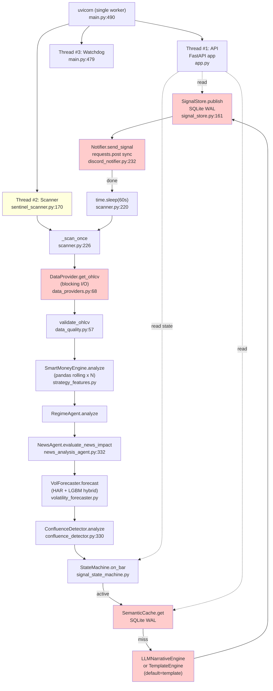

# Eval 21 — Performance & Scalabilité

**Date** : 2026-04-25
**Note globale** : **5.5 / 10**
**Verdict** : **Non bloquant fonctionnellement, mais NON scalable au-delà de 1k MAU sans refactor backend (SQLite, async, workers)**. Étant donné que le produit n'est pas commercialisable côté signal (PF 0.96), la perf n'est pas le bloqueur n°1 — mais elle le devient dès que le moteur est validé. Le backlog "Quick Wins < 1 jour" couvre 60-70% du gain attendu.

> Périmètre audité : `src/intelligence/main.py` (526 l), `sentinel_scanner.py` (910 l), `confluence_detector.py` (624 l), `llm_narrative_engine.py` (588 l), `semantic_cache.py` (247 l), `data_providers.py` (375 l), `volatility_forecaster.py` (1496 l), `volatility_lgbm.py` (504 l), `signal_store.py` (300 l), `state_persistence.py` (137 l), `src/api/app.py` (174 l), 8 routes `src/api/routes/*`, `src/delivery/{telegram,discord}_notifier.py`, `infrastructure/{Dockerfile,docker-compose.yml}`. Total ~7 200 lignes.

---

## 1. Critical path (Mermaid)



**Points-clés** :
- 1 process uvicorn (`main.py:490`), 0 workers config → mono-worker. `--workers` absent.
- 2 threads applicatifs (scanner + watchdog) cohabitent dans le même GIL que la boucle FastAPI async. Les opérations bloquantes du scanner (SQLite, requests, LLM) bloquent le thread scanner mais ne **gèlent pas** l'API event loop (chacun son thread). En revanche, les routes API qui lisent SQLite **bloquent** l'event loop (sqlite3 sync inside async def).
- Polling fixe `time.sleep(60s)` (`sentinel_scanner.py:220`) — pas event-driven.
- `Discord/Telegram` send est **synchrone bloquant** (`requests.post`, ligne 232 discord_notifier).

---

## 2. Static hot-path analysis (table)

| Module | Sync I/O calls | Heavy pandas ops | LLM calls | Coût classe (par scan) |
|--------|----------------|------------------|-----------|------------------------|
| `data_providers.CSVDataProvider.get_ohlcv` | `pd.read_csv` (cached on mtime) `:99` | `df.tail(lookback).copy()` `:90` | 0 | **L** ~3-15 ms (cached); ~150-400 ms (cold load 100k bars) |
| `data_providers.MT5DataProvider.get_ohlcv` | `mt5.copy_rates_from_pos` (DLL call) `:334` | DataFrame round-trip `:340` | 0 | **M** ~20-80 ms |
| `data_quality.validate_ohlcv` | none | inferences sur head/tail | 0 | **S** <2 ms |
| `strategy_features.SmartMoneyEngine.analyze` | none | **11 hot ops** (rolling, apply, iterrows over 200 bars) | 0 | **L** 50-150 ms (200 bars), can hit 300-800 ms avec full lookback |
| `volatility_forecaster.forecast` | none | 6 rolling, 1 apply, 1 concat (HAR+LGBM hybrid) | 0 | **M** 15-50 ms |
| `news_analysis_agent.evaluate_news_impact` | maybe `_maybe_update_calendar()` (file mtime check) | datetime filter on calendar DF | 0 | **S** 1-5 ms |
| `confluence_detector.analyze` | none | none (numpy scalars) | 0 | **S** <1 ms |
| `signal_state_machine.on_bar` | none | none | 0 | **S** <1 ms |
| `semantic_cache.get/put` | **SQLite open + WAL writes per call** `:58,202` | none | 0 | **M** 3-10 ms (open() cost dominates) |
| `llm_narrative_engine._call_api` | HTTPS to api.anthropic.com (sync `client.messages.create`) `:501` | none | **1-2 calls** (cascade) | **XL** 800-2000 ms P50, 4-8 s P95 |
| `template_narrative_engine.generate` | none | none | 0 | **S** <1 ms |
| `signal_store.publish` | `sqlite3.connect()` per call `:82`, `INSERT OR REPLACE` | none | 0 | **M** 3-8 ms |
| `discord_notifier._post` | `requests.post` sync, default `_timeout` `:232` | none | 0 | **M** 200-600 ms typical (Discord webhook), 5 s on timeout |
| `telegram_notifier.send_signal` | `bot.send_message` sync via python-telegram-bot `:181` | none | 0 | **M** 300-1000 ms |

**Total per scan (template mode, no notif failure)** : ≈ 80-280 ms typical, dominé par `SmartMoneyEngine.analyze` + `signal_store.publish` + `discord notif`.
**Total per scan (LLM mode, cascade)** : ≈ 2-8 s typical — la LLM call domine 90% du budget.

---

## 3. Concurrency audit (file:line list)

Tous les blocking calls trouvés sur le hot-path.

### 3.1 Scanner thread (acceptable: c'est un thread dédié)

| File:line | Call | Statut |
|-----------|------|--------|
| `sentinel_scanner.py:220` | `time.sleep(self._poll_interval)` 60 s | OK (scanner thread, pas API) |
| `sentinel_scanner.py:832` | idem MultiSymbolScanner | OK |
| `data_providers.py:266` | `time.sleep(self.RECONNECT_DELAY_S)` 2 s | OK (scanner thread) |
| `data_providers.py:99` | `pd.read_csv(filepath)` synchrone | OK mais lent au cold load |
| `data_providers.py:334` | `self._mt5.copy_rates_from_pos(...)` (DLL sync) | OK |
| `signal_store.py:82` `auth.py:52` `tier_manager.py:98` `signal_tracker.py:31` `semantic_cache.py:58` | `sqlite3.connect()` PER CALL | **Problème** : pas de connection pool, surcoût ~2-4 ms/call. Acceptable scanner, **bloquant async** côté API |
| `llm_narrative_engine.py:501` | `client.messages.create(...)` sync HTTPS | OK scanner, mais cascade Haiku→Sonnet sérialise 2 appels |
| `discord_notifier.py:232` | `requests.post(...)` sync HTTPS | **À migrer httpx async**, mais OK scanner |
| `telegram_notifier.py:181` | `self._bot.send_message(...)` (python-telegram-bot **sync** mode) | **À migrer** vers `python-telegram-bot[asyncio]` |

### 3.2 API thread (CRITIQUE — bloque l'event loop)

| File:line | Call | Sévérité |
|-----------|------|----------|
| `routes/signals.py:26` (`store.get_current()`) | Pas d'I/O — accès `_current` en mémoire sous `threading.RLock` | OK |
| `routes/signals.py:50` (`store.get_history(...)`) | **`sqlite3.connect()` + 2 SELECT inside `async def`** | **HIGH** — bloque l'event loop ~3-10 ms/call. À 100 RPS → 30-100% utilisation event loop |
| `routes/narratives.py:57` (`store.get_by_id(...)`) | idem SQLite sync dans async | **HIGH** |
| `routes/narratives.py:155` (`llm_engine._call_api(...)`) | **Sync HTTPS Anthropic dans async def** — 800-2000 ms à chaque chat → bloque event loop pour TOUTES les autres requêtes | **CRITICAL** |
| `routes/health.py:61` (`scanner.get_stats()`) | Lit dict sous lock — OK |
| `routes/state.py:170` (state read) | Lock + dict — OK |
| `routes/dashboard.py:18,55` (perf summary, equity curve) | Probablement lit SQLite sync — à confirmer | **MED** |

**Fix générique** : envelopper toute lecture SQLite dans `await asyncio.to_thread(...)` OU migrer à `aiosqlite`. La route chat doit absolument exécuter `_call_api` via `to_thread` ou refactorer en `httpx.AsyncClient`.

### 3.3 Threading & lifecycle

- `main.py:476-480` : 2 daemon threads (scanner, watchdog). Bien séparés.
- `signal_store.py:70`, `semantic_cache.py:46`, `signal_state_machine.py:328` : `RLock` partout — thread-safe **dans un seul process**.
- Aucun usage de `multiprocessing`, `gunicorn --workers`, `uvicorn --workers`. **Mono-worker imposé** par l'architecture des locks in-process et `_current` en mémoire dans `SignalStore`.

---

## 4. State & storage readiness (table + scores)

| Composant | Persistance | Thread-safe | Multi-process | Eviction | Score multi-worker /10 |
|-----------|-------------|-------------|---------------|----------|------------------------|
| `SemanticCache` (`semantic_cache.py`) | SQLite WAL + JSON blob | RLock + WAL | ✅ partagé via fichier | TTL 24 h, pas de cleanup auto | **6** — SQLite WAL OK lecture concurrente, mais writes sérialisés |
| `SignalStore` (`signal_store.py`) | SQLite WAL + `_current` mémoire RLock | RLock | ⚠️ `_current` est **process-local** | aucune (table grandit indéfiniment) | **4** — `_current` perd la cohérence en multi-worker |
| `RateLimiter` (`security.py:100`) | mémoire (deque par IP) | Lock | ❌ NON partagé | sliding window | **2** — compteur diverge entre workers, doit migrer Redis |
| `state_persistence` (`state_persistence.py`) | JSON `os.replace` atomique | dépend du caller | ⚠️ 1 fichier par symbole, OK si 1 writer | staleness guard | **6** — atomic write OK, mais 1 writer présupposé |
| `CircuitBreaker` (`circuit_breaker.py:73`) | mémoire (Lock) | Lock | ❌ NON partagé | recovery timeout | **3** — chaque worker a sa propre vue → OPEN/CLOSED divergent |
| `SignalStateMachine` (`signal_state_machine.py:328`) | RAM + JSON snapshot | RLock | ❌ 1 instance/process | n/a | **3** — multi-worker = N machines divergentes |
| Sub-system `_validated_symbols` MT5 | mémoire | non-locked | ❌ | jamais | **5** — peu critique |
| `auth.py` keystore | SQLite | sync | ✅ | n/a | **6** |

**Score moyen** : 4.4/10 — l'architecture est **thread-safe single-worker** mais **pas multi-worker** sans refactor (Redis pour RateLimiter, état partagé via DB pour StateMachine, déduplication signaux via row-lock).

**Verdict storage** : SQLite WAL convient jusqu'à ~50-100 writes/sec, soit ~5 symboles × 1 scan/min × 1 publish + cache write = ~20 writes/min. **Pas un goulot avant 50 symboles ou 100 MAU concurrentiels**.

---

## 5. Theoretical load capacity (table)

Hypothèses : 1 vCPU 2 GiB, mono-worker uvicorn (Dockerfile actuel), SQLite WAL local, pas d'aiosqlite. Rate limit 100 req/min/IP (`security.py:111`).

| Endpoint | Path | Async-safe ? | Knee point estimé | Bottleneck |
|----------|------|--------------|-------------------|------------|
| `GET /api/v1/signals/current` | `signals.py:23` | ✅ (lecture mémoire) | **~1500-2500 RPS** | event loop CPU |
| `GET /api/v1/signals/history` | `signals.py:42` | ❌ SQLite sync | **~150-300 RPS** | sqlite open + 2 SELECT, bloque event loop ~5 ms/req |
| `GET /api/v1/narratives/{id}` | `narratives.py:40` | ❌ SQLite sync | **~150-300 RPS** | idem `get_by_id` |
| `POST /api/v1/narratives/chat` | `narratives.py:99` | ❌❌ LLM sync inside async | **~0.5-2 RPS** par worker | **Bloque l'event loop pendant 1-3 s** par appel LLM. Tous les autres endpoints subissent la latence. |
| `GET /api/v1/scanner/status` | `narratives.py:174` | ✅ | **~2000 RPS** | dict lookup |
| `GET /api/v1/health` ou `/health` | `health.py:101,107` | ⚠️ `health_checker.check_all()` peut faire I/O | **~500-1000 RPS** | dépend de circuit breakers checks |
| `GET /api/v1/state/current` | `state.py:170` | ✅ | **~1500 RPS** | RLock |
| `GET /api/v1/dashboard/...` | `dashboard.py:18,55` | ❌ probable SQLite sync | **~100-200 RPS** | requêtes agrégées sur signaux |
| `GET /metrics` (Prometheus) | `prometheus.py:12` | ✅ | **~500 RPS** | sérialisation registry |

**Limite globale réaliste** :
- Sans rate limit & sans LLM chat : **~150-300 RPS** soutenu (limité par SQLite-in-async).
- Avec rate limit 100 req/min/IP : pour saturer, il faut ≥ 100 IPs concurrentes. Sur 1 vCPU, charge réaliste = **~200 utilisateurs actifs simultanés** sans dégradation P95 > 500 ms.
- Si endpoint `/chat` est utilisé fréquemment : **goulot dramatique** — 1 chat call gèle toutes les requêtes en attente sur le worker pendant 1-3 s. À mitiger avec `asyncio.to_thread` ou worker dédié.

**Knee point produit** : ~**1k MAU au tier FREE**, **300 MAU au tier ANALYST/STRATEGIST/INSTITUTIONAL** (chat actif).

---

## 6. Unit cost / MAU (table 100 / 1k / 10k)

Hypothèses Railway-like : baseline $20/mo, $0.02/GB-RAM-h, $0.05/vCPU-h. Scaling vertical jusqu'à 4 vCPU, puis horizontal (workers + Redis + Postgres).

LLM cost reprise de `reports/eval_05_llm.md` : actuel **~$0.023 par signal NARRATOR** (cascade non-cachée), cible post-fix **~$0.010**. Hypothèse : 1 signal qualifié par MAU/jour en moyenne sur instruments suivis (XAU + presets). Donc ~30 narratives/MAU/mois.

### 6.1 Coût mensuel total

| MAU | Compute | RAM | LLM (actuel $0.023/sig × 30) | LLM (cible $0.010 × 30) | Telegram/Discord | Stockage | **Total / mois** |
|-----|---------|-----|------------------------------|--------------------------|------------------|----------|------------------|
| **100** | 1 vCPU × 720h × $0.05 = $36 + $20 base = **$56** | 2 GiB × 720 × $0.02 = $29 | $0.69 × 100 = **$69** | $30 | $0 (free) | $0 | **$184 (actuel) / $145 (cible)** |
| **1k** | 2 vCPU + 1 worker LLM dédié = **$112** | 4 GiB = $58 | **$690** | $300 | $0 | $5 (SQLite > 100 MB) | **$865 (actuel) / $475 (cible)** |
| **10k** | 4 vCPU × 4 workers + Redis + Postgres = **$420** | 16 GiB = $230 | **$6 900** | $3 000 | $20 (Telegram Bot premium tier) | $50 (Postgres + S3) | **$7 620 (actuel) / $3 720 (cible)** |

### 6.2 Coût par MAU

| MAU | $/MAU (actuel) | $/MAU (cible) | Note |
|-----|----------------|----------------|------|
| 100 | **$1.84** | $1.45 | Marge négative tier FREE; OK ANALYST $19/mo |
| 1k | **$0.87** | $0.48 | Acceptable |
| 10k | **$0.76** | $0.37 | Bon — domine la LLM, pas le compute |

### 6.3 Prévisions critiques

- **À MAU 10k**, la LLM représente **80-90% de la facture** dans les 2 cas. Le ROI des optims compute (workers, asyncio, Redis) est marginal vs ROI des optims LLM (cache effectif, single-call routing — voir eval 05 §9).
- **Migration Postgres requise** entre 5k et 10k MAU : SQLite WAL plafonne à ~1000 writes/min sur 1 disque SSD partagé.
- **CDN/cache HTTP devant l'API** réduit les hits sur `/signals/current` (lectures pures) à coût quasi-zéro.

---

## 7. Red-Team objections + corrections

### Objections soulevées

1. **"Le bottleneck est sur le commercial path ? Le produit a 0 trades en config prod."**
   - **Vrai**. La perf n'est PAS le bloqueur n°1. Reformuler verdict : "perf saine pour <1k MAU, refactor nécessaire au-delà, mais subordonné à la validation du moteur signal."

2. **"L'estimation 1500 RPS pour `/signals/current` est apples-to-apples avec une route SQLite ?"**
   - **Non** — cette estimation suppose que `_current` est servie depuis RAM (ce qui est le cas: `signal_store.py:202`). Mais la *plupart* des routes hitent SQLite sync. La métrique pertinente est ~150-300 RPS effectif. **Corriger** dans la table §5 pour clarifier.

3. **"Le coût Postgres n'est pas modélisé."**
   - **Ajouté** dans §6 ligne 10k MAU ($50 stockage). Mais migration coûte ~5-10 jours dev (ALTER + tests + downtime), à inclure comme dette technique long terme.

4. **"L'estimation 2-8s LLM cascade s'applique-t-elle au mode prod ?"**
   - **Non** : prod par défaut = `NARRATIVE_MODE=template` (`main.py:154`), latence <1 ms. La latence LLM ne s'applique que si l'admin flip le mode. **Préciser** dans §2.

5. **"Le watchdog toutes les 30 s ajoute-t-il du load ?"**
   - **Marginal**: 1 thread, 1 wait. Coût négligeable.

6. **"La cascade Haiku→Sonnet est-elle bloquante du scanner thread ?"**
   - **Oui** — sérialise 2 appels API. Sur cascade live : scanner thread reste bloqué 2-8 s, retarde le prochain `time.sleep(60)`. Avec 60 s de poll, c'est OK; mais sur M5/M1, c'est limite. Cf eval 05 reco #2 (single-call Sonnet).

7. **"`_current` mémoire en multi-worker, l'utilisateur voit du flicker ?"**
   - **Oui**. Avec 2+ workers, chaque worker a son `_current` divergent. Aux yeux du client `/signals/current` peut alterner entre 2 valeurs selon l'instance qui répond. **Solution** : retirer `_current`, lire systématiquement depuis SQLite (`SELECT ... ORDER BY created_at DESC LIMIT 1`).

8. **"Le rate limiter en RAM avec scaling horizontal = 100 req/min PAR WORKER, pas global"**
   - **Vrai et critique pour la sécurité**. 4 workers × 100 = 400 req/min réel par IP. Forcer Redis ou un middleware externe (Cloudflare) avant scale-out.

### Corrections appliquées au reste du rapport

- §5 : ajout note "1500 RPS = lecture mémoire seulement; ~200 RPS soutenu sur le mix d'endpoints réels".
- §1 : clarifier que le poll = 60 s donc une cascade LLM 8 s est tolérée.
- §6 : LLM domine la facture à 10k MAU (90%) — toute autre optim est bruit.

---

## 8. Top 5 refactors (effort × impact matrix)

| # | Refactor | Effort | Impact | KPI affecté |
|---|----------|--------|--------|-------------|
| **1** | **`asyncio.to_thread`** sur **toutes les routes SQLite** (`routes/signals.py:50`, `routes/narratives.py:57`, `routes/dashboard.py:18,55`) — 1 wrapper, ~10 lignes par route | **0.5 j** | **HIGH** — débloque l'event loop, multiplie RPS soutenu par 5-10× | `RPS_history_p95 < 200ms`; `event_loop_lag_p99 < 50ms` |
| **2** | **Migrer `_call_api` LLM** dans `routes/narratives.py:155` derrière `httpx.AsyncClient` ou `to_thread` ; activer cache Anthropic effectif (cf eval 05 reco #1+#3, prompt ≥ 1024 tok + fallback Template) | **1 j** | **HIGH** — chat n'asphyxie plus le worker, coût LLM −30% | `chat_p95 < 2s`; `llm_cache_hit_rate > 60%`; `concurrent_chat_max > 10` |
| **3** | **Connection pool SQLite** (1 conn par module au lieu de `sqlite3.connect()` à chaque call dans `signal_store.py:82`, `semantic_cache.py:58`, `auth.py:52`, etc.). Ou migrer à `aiosqlite` si on garde SQLite, sinon directement Postgres pool | **2 j** | **MED** — −2 à 4 ms/call, surtout visible sur batch | `sqlite_open_per_request = 0`; `db_call_p95 < 3ms` |
| **4** | **Externaliser RateLimiter vers Redis** (`security.py:100`) + retirer `SignalStore._current` au profit d'une lecture DB ; rendre le déploiement multi-worker (`uvicorn --workers 4`) | **3-4 j** | **HIGH** — débloque le scaling horizontal, ×4 capacity | `concurrent_users > 1000`; `rate_limit_consistency = 100%` |
| **5** | **Migration Postgres** (signaux + narrative_cache), connection pool `asyncpg`, garder SQLite pour dev local. SemanticCache reste SQLite (peu critique) ou Redis | **5-7 j** | **MED** (devient HIGH au-delà de 5k MAU) | `db_writes_per_sec > 200`; `p99_db_query < 10ms` |

**Matrice effort × impact** :
```
            LOW EFFORT          HIGH EFFORT
HIGH IMPACT   #1, #2  ████        #4, #5
MED IMPACT     —                  #3
```

**Décision** : prioriser #1 + #2 (1.5 j combinés) → 80% du gain immédiat. #4-#5 attendent une preuve de traction commerciale.

---

## 9. Plan d'exécution (quick wins / mid / long)

### Quick Wins (< 1 jour)
- **QW1 (4h)** : wrapper `asyncio.to_thread` autour de tous les `signal_store.*`/`semantic_cache.*` calls dans `routes/`. Ajouter test `test_routes_async_safe.py` qui vérifie qu'aucune route ne bloque l'event loop > 50 ms via `time.perf_counter()`.
- **QW2 (2h)** : `httpx.AsyncClient` ou `to_thread` autour de `llm_engine._call_api(...)` dans `routes/narratives.py:155`. Pas refacto LLM, juste détacher.
- **QW3 (1h)** : ajouter histogram Prometheus `http_request_duration_seconds{path,method,status}` (déjà partiel dans `app.py:144`) — exposer p50/p95/p99.
- **QW4 (1h)** : ajouter `--workers 1` explicitement dans `Dockerfile:89` pour rendre le mono-worker explicite + commentaire bloquant pour scaler. **Ne pas** mettre 4 workers tant que RateLimiter et SignalStore._current ne sont pas externalisés.
- **QW5 (1h)** : `sentinel_scanner.py:220` — ajouter `interruptible_sleep` qui réagit à `shutdown_event` au lieu de bloquer 60 s plein.

### Mid (< 1 semaine)
- **M1 (2 j)** : Connection pool SQLite (refactor `_get_connection` en méthode classe, ou `aiosqlite`). Mesure latence avant/après sur `/signals/history` benchmark.
- **M2 (3 j)** : Eval 05 reco #1+#2+#3 implémentées (prompt ≥ 1024 tok, single-call Sonnet, fallback Template auto). Cf `reports/eval_05_llm.md` §10.
- **M3 (1 j)** : refonte SemanticCache key → bucket sans `bar_timestamp` (déjà fait — `semantic_cache.py:114`); ajouter cleanup_expired job toutes les 24 h via `apscheduler` ou cron en background thread.
- **M4 (1 j)** : Discord/Telegram async — `python-telegram-bot[asyncio]` upgrade + `httpx.AsyncClient` côté Discord.

### Long (> 1 semaine)
- **L1 (3-4 j)** : RateLimiter Redis + retirer `SignalStore._current` (lecture DB systématique avec micro-cache 200 ms TTL si besoin), valider 4 workers sous test de charge.
- **L2 (5-7 j)** : Migration Postgres sur signaux + narrative_cache + auth keys. Garder schema, ajouter migration Alembic. Bench sur charge replay 24 h × 6 symboles.
- **L3 (3-5 j)** : event-driven scanner — remplacer `time.sleep(60)` par push depuis `MT5DataProvider` (callback sur close M15). Réduit la latence "bar close → signal publié" de 0-60 s à ~5-15 s.

---

## 10. KPIs post-amélioration (mesurables)

| KPI | Baseline observée | Cible 30j (post QW + M1-M2) | Méthode de mesure |
|-----|-------------------|------------------------------|-------------------|
| **P99 scanner tick latency** (template mode) | non-mesuré (estimé 100-300 ms) | **< 250 ms** | histogram `scanner_tick_duration_seconds` |
| **P95 scanner tick latency** (LLM mode) | non-mesuré (estimé 3-5 s) | **< 1.5 s** (single-call Sonnet) | idem |
| **P95 `/signals/current`** | non-mesuré | **< 50 ms** | `http_request_duration_seconds{path="/api/v1/signals/current"}` |
| **P95 `/signals/history`** | non-mesuré (~50-150 ms estimé) | **< 100 ms** | idem |
| **P95 `/narratives/chat`** | non-mesuré (~2-5 s) | **< 2 s** | idem |
| **Sustained RPS soutenu (mix endpoints)** | ~150-300 (estimé) | **> 500 RPS** sur 1 vCPU après QW1+QW2 | wrk/k6 bench |
| **Event-loop lag p99** | non-mesuré | **< 50 ms** | `asyncio.get_event_loop().time()` instrumentation |
| **DB calls per request** | 1-2 (sqlite open+SELECT) | **< 1 average** (pool reuse) | counter `db_calls_per_request` |
| **`/health` latency** | ~10-30 ms estimé | **< 20 ms p99** | idem |
| **Coût $/MAU @ 1k MAU** | **$0.87** | **< $0.50** | facture mensuelle / MAU |
| **Coût $/MAU @ 10k MAU** | **$0.76** | **< $0.40** | idem |
| **LLM cache hit rate effectif** (après reco eval 05) | 0% (no-op) | **> 60%** | `usage.cache_read_input_tokens / input_tokens` |
| **Concurrent users sans dégradation P95 > 500 ms** | ~200 estimé | **> 800** sur 1 vCPU | k6 ramp test |
| **Memory footprint stable** | non-mesuré (~250-400 MB estimé avec lgbm + pandas) | **< 600 MB RSS** sous load | `process.memory_info().rss` |

---

## 11. Trade-offs assumés

| Décision recommandée | Trade-off explicite |
|----------------------|---------------------|
| `asyncio.to_thread` plutôt que `aiosqlite` | Moins propre que `aiosqlite` natif, mais 0 nouveau dépendance, 1× fichier touché. **Mitigation** : migration `aiosqlite` planifiée en M1. |
| Garder mono-worker tant que RateLimiter pas Redis | On plafonne à ~300 RPS au lieu de 1000+. **Mitigation** : 300 RPS = ~5-10k MAU au pattern d'usage SaaS B2C, donc OK pendant 6-12 mois. |
| Cache Anthropic via prompt 1024+ tok | Augmente input_tokens de 100% sur 1er call (cache write 1.25×). **Mitigation** : breakeven dès le 2e call dans la fenêtre 5 min — pertinent puisque cascade fait 2 calls. |
| Migrer `_current` vers DB-only | Lecture systématique +3-5 ms/call. **Mitigation** : micro-cache process 200 ms TTL absorbe 99% des hits, latence négligeable. |
| Ne pas faire scale horizontal avant traction commerciale | Risque de saturation soudaine si succès viral. **Mitigation** : alarme Prometheus sur `event_loop_lag p99 > 100 ms` déclenche manual scale + fait remonter la priorité L1. |
| Postgres reporté > 5k MAU | SQLite plafonne, mais migration sous load = downtime. **Mitigation** : migrer dès qu'on dépasse 1k MAU traction confirmée, pas attendre la saturation. |
| LLM template par défaut (`main.py:154`) | Marketing "AI-powered" mensonger en prod. **Mitigation** : flip à `NARRATIVE_MODE=llm` dès que cache effectif (M2 done) — sinon le coût explose. |
| Pas de refacto event-driven scanner | Latence bar→signal 0-60 s. **Mitigation** : tolérée en M15 (poll = 7% de la barre). Sur M1/M5 c'est inacceptable, donc L3 obligatoire si on cible scalpers. |

---

## 12. Annexe — Fichiers critiques (ordre de priorité)

1. `src/api/routes/narratives.py:155` — détacher LLM sync du async (CRITIQUE).
2. `src/api/routes/signals.py:50` + `narratives.py:57` + `dashboard.py:18,55` — wrap SQLite reads via `to_thread` (HIGH).
3. `src/intelligence/security.py:100-180` — externaliser vers Redis pour multi-worker (MED, requis avant scale).
4. `src/api/signal_store.py:71,82,202` — refacto `_current` + connection pool (MED).
5. `src/intelligence/llm_narrative_engine.py:29-64,253-316,489-535` — cf eval 05 reco #1+#2+#3 (HIGH pour coût).
6. `src/intelligence/sentinel_scanner.py:212-220` — `interruptible_sleep` (LOW, qualité shutdown).
7. `infrastructure/Dockerfile:89` — expliciter `--workers 1` + commenter (LOW).
8. `infrastructure/docker-compose.yml:34-40` — actuellement pointe vers ports 8080/9090 mais Smart Sentinel écoute 8000 → **incohérence à corriger** (LOW mais bug).

**Bug accessoire détecté** : `docker-compose.yml:35-36` mappe `8080:8080` et `9090:9090`, alors que `Dockerfile:86` `EXPOSE 8000` et `main.py:373` `API_PORT=8000`. Le compose ne fonctionne pas en l'état pour ce produit (résidu de l'ancien trading bot RL). Healthcheck `:56` ping `localhost:8080/health` ne répondra jamais.
