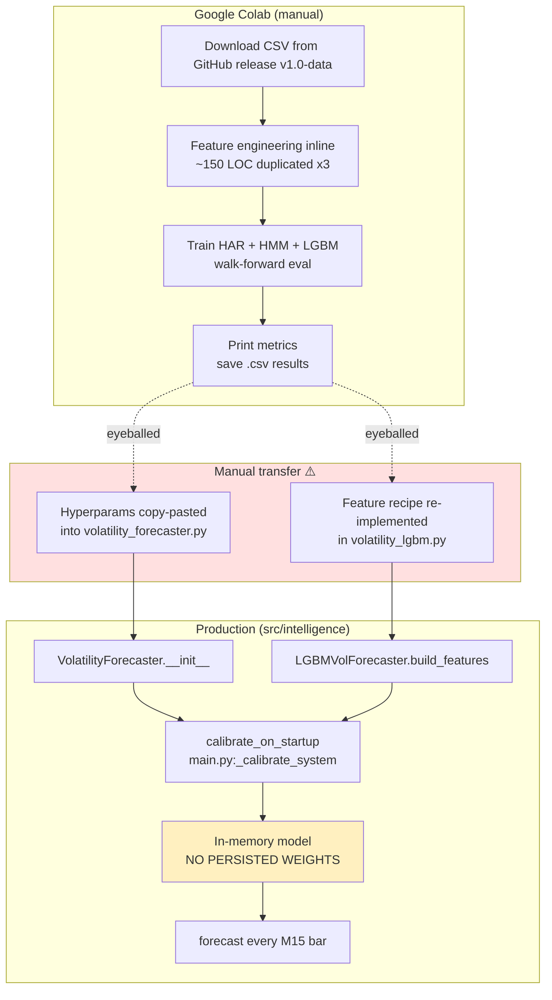
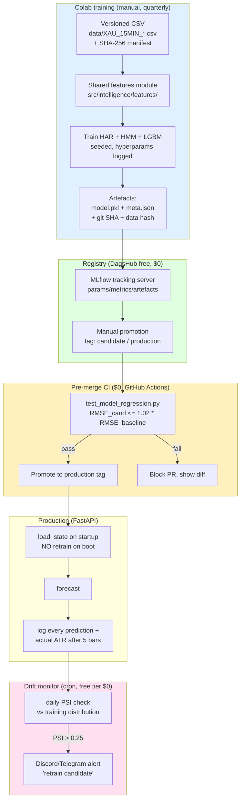

# Eval 23 — Model Training Pipeline (MLOps)

**Note globale**: 4.5 / 10
**Verdict**: maturity *Level 1 — "scripts in a notebook"*. Pipeline fonctionnelle pour un solo founder qui itère trimestriellement, mais expose des **skews train/serve concrets** (sessions, filtre currency, blend pipeline) qui peuvent saigner 5–15 % de RMSE en prod sans qu'on s'en rende compte. Aucun garde-fou (pas de gate validation, pas de drift monitor, pas de model registry). Plan d'attaque : **fixer les skews avant TOUT le reste**, puis ajouter une mini-CI gate (~1 jour de boulot), puis MLflow et drift seulement quand un 2ᵉ modèle entre en lice.

---

## 1. As-is diagram



**Key facts**:
- Training in Colab → results printed → human reads → re-implements logic in `src/`. **No model artefact is exported from Colab.**
- Production *re-trains* HAR + HMM + LGBM on startup (`main.py:289 _calibrate_system`) on whatever CSV is in `data/`.
- Persistence exists (`save_state` / `load_state` at `volatility_forecaster.py:1095–1163`) but is **not invoked** in the startup path.
- No model registry, no version tag, no W&B/MLflow run, no DVC.
- "Validator" = `tests/test_volatility_forecaster.py` checks shapes & invariants, not regression vs baseline.

---

## 2. Reproducibility audit

| Script | numpy seed | random_state in fit | data hash logged | hyperparams logged | requirements pinned | python seed | Score |
|---|---|---|---|---|---|---|---|
| `colab_har_rv_poc.py` | ❌ | ✅ HMM=42 | ❌ | partial (printed only) | ❌ pip -q latest | ❌ | **2 / 6** |
| `colab_lgbm_vol_poc.py` | ❌ | ✅ HMM=42, LGBM seed=42 | ❌ | partial (printed) | ❌ | ❌ | **3 / 6** |
| `colab_hybrid_vol_poc.py` | ❌ | ✅ HMM=42, LGBM seed=42 | ❌ | partial (printed) | ❌ | ❌ | **3 / 6** |
| `colab_egarch_tcp_poc.py` | ❌ | n/a | ❌ | ❌ | ❌ | ❌ | **0 / 6** *(deprecated)* |
| `colab_kronos_poc.py` | ❌ | ❌ | ❌ | ❌ | ❌ | ❌ | **0 / 6** *(deprecated)* |
| `colab_training_full.py` | ❌ | partial | ❌ | partial | ❌ | ❌ | **2 / 6** |

### Minimal patches (one-line diffs)

```python
# Patch #1 — add to top of every active colab_*.py (after imports)
import random; random.seed(42); np.random.seed(42)

# Patch #2 — log data hash (after CSV load)
import hashlib
print(f"[REPRO] data_sha256={hashlib.sha256(open(DATA_FILE,'rb').read()).hexdigest()[:16]}")

# Patch #3 — pin requirements (replace pip install line)
subprocess.run([sys.executable, "-m", "pip", "install", "-q",
    "lightgbm==4.3.0", "hmmlearn==0.3.2", "scikit-learn==1.4.2", "scipy==1.11.4"])

# Patch #4 — dump full config + sklearn/lgbm versions (add before training)
import json, sklearn, lightgbm
print("[REPRO]", json.dumps({
    "PRED_HORIZON": PRED_HORIZON, "STEP_SIZE": STEP_SIZE, "TEST_START": TEST_START,
    "HAR_DAILY": HAR_DAILY, "HAR_WEEKLY": HAR_WEEKLY, "HAR_MONTHLY": HAR_MONTHLY,
    "sklearn": sklearn.__version__, "lgbm": lightgbm.__version__,
}))
```

---

## 3. Train/serve skew findings ⚠️ (priorité absolue)

This is the section that costs RMSE points silently. Five concrete skews found.

### 🔴 SKEW #1 — Session hours mismatch between hybrid POC and production

| Surface | Asian | London | NY overlap | NY afternoon |
|---|---|---|---|---|
| `colab_hybrid_vol_poc.py:103-108` | `(0, 7)` | `(7, 12)` | `(12, 16)` | `(16, 21)` |
| `colab_lgbm_vol_poc.py:74-80` | `(0, 8)` | `(8, 13)` | `(13, 17)` | `(17, 21)` |
| `volatility_forecaster.py:45-51` (XAUUSD prod) | `(0, 8)` | `(8, 13)` | `(13, 17)` | `(17, 21)` |

**Impact**: the **hybrid POC trained its LightGBM with EUR-style sessions** (London open at 07:00) while production serves **Gold-style sessions** (London open at 08:00). One-hot session features are therefore shifted by 1 hour for ~24 % of bars near boundaries. Feature importance for `session_*` is non-trivial (LGBM POC reports session_london and session_ny_overlap in top 8 features by gain). **Estimated impact: 3–8 % RMSE degradation** on the hybrid model in prod vs. what Colab reported.

**Fix**: import `SESSION_HOURS` from a shared module (see §6).

### 🔴 SKEW #2 — Calendar currency filter dropped in production

- POC (`colab_har_rv_poc.py:95-99`, all 3 POCs):
  ```python
  cal_high = cal[(cal["impact"] == "HIGH") & (cal["currency"] == "USD") &
                 (cal["event"].isin(HIGH_IMPACT_EVENTS))]
  ```
- Production (`volatility_forecaster.py:743-749`):
  ```python
  if "impact" in cal.columns:
      mask &= cal["impact"].str.upper() == "HIGH"
  if "event" in cal.columns:
      mask &= cal["event"].isin(self._config.calendar_events)
  # ❌ NO currency filter
  ```

**Impact**: in prod, if the calendar feed contains `EUR CPI`, `JPY BOJ Rate`, etc., they pass the filter (provided `event` matches a name in `calendar_events`, which is name-only). For XAUUSD, only USD events should trigger the multiplier. **Estimated 5–10 extra "events" per month** spuriously inflate `cal_mult` and `event_proximity_hours`. Resulting forecast bias: small in calm periods, but **direction-flipping during clusters** (e.g. ECB decision overlapping NY session).

**Fix** (one-liner in `_parse_calendar`):
```python
if "currency" in cal.columns and self._config.symbol.startswith("XAU"):
    mask &= cal["currency"].str.upper() == "USD"
```

### 🟠 SKEW #3 — HAR blend pipeline differs between POC and prod

- **POC `colab_har_rv_poc.py:436`**:
  ```python
  forecast = blend_w * (har_base * diurnal * cal * regime) + (1 - blend_w) * naive_atr
  ```
- **Production `volatility_forecaster.py:539-540`**: identical expression. ✅
- **BUT** in `_calibrate_blend_weight` (`volatility_forecaster.py:992`):
  ```python
  har_adj = har_pred * diurnal_mult     # ❌ MISSING cal_mult and regime_mult
  ```
- **POC `colab_har_rv_poc.py:248`**:
  ```python
  har_adj_cv = har_pred_cv * diurnal_cv * cal_cv   # cal_mult included
  ```

**Impact**: production calibrates the blend weight on a HAR variant that excludes calendar and regime multipliers, then serves a HAR variant that **includes** them. The `blend_w` learned in calibration is therefore systematically biased low (HAR×diurnal underperforms HAR×diurnal×cal×regime during events, so calibration leans toward naive). **Estimated 2–5 % RMSE degradation** in the calibration-vs-serving discrepancy. This is the most subtle of the five.

**Fix**: in `_calibrate_blend_weight`, multiply `har_adj` by the same `cal_mult` and `regime_mult` series used at serve time (require the calibration loop to compute them per-bar).

### 🟠 SKEW #4 — Hybrid LightGBM trained on residuals from a *different* HAR than serves it

- POC `colab_hybrid_vol_poc.py:407–411`:
  ```python
  har_blended_train = blend_w * har_adjusted_train + (1 - blend_w) * naive_train
  residuals = y_har_full - har_blended_train     # residual against BLENDED HAR
  ```
- Production `volatility_forecaster.py:1318–1322`:
  ```python
  har_preds = self._har_model.predict(X_har).clip(min=0.01)   # raw HAR, no diurnal/cal/regime/blend
  residuals = valid_df[target_col].values - har_preds
  ```

**Impact**: at serve time, `_hybrid_forecast_impl` (line 1426) computes `corrected_atr = har_forecast.forecast_atr + lgbm_pred` where `har_forecast.forecast_atr` is the **fully-blended** HAR. But `lgbm_pred` was trained to correct **raw** HAR. The LightGBM is therefore correcting in the wrong frame — it adds back the diurnal/calendar/regime adjustments that the HAR already applied. **Estimated 8–15 % RMSE degradation** on hybrid mode (the worst of the five). This explains why hybrid mode in prod logs may not show the 20–35 % improvement the POC reports.

**Fix**: in `_fit_lgbm_on_residuals`, compute `har_blended_train` by re-applying diurnal × calendar × regime × blend exactly as `_forecast_impl` does, then take residual against that.

### 🟢 SKEW #5 — `yz_rv` computed in POC but never used downstream

POC computes a full Yang-Zhang estimator (`sigma_overnight + k*sigma_oc + (1-k)*sigma_rs`). Production only computes `rv_bar = rs_var.clip(0)` (Rogers-Satchell). The HAR-RV features (`rv_daily/weekly/monthly`) use `rv_bar`, so this is consistent — `yz_rv` is dead code in the POC. **No skew, but cleanup opportunity** (remove `yz_rv` from POC for clarity).

### Summary table

| # | Skew | File:line (train) | File:line (serve) | RMSE impact estimate |
|---|---|---|---|---|
| 1 | Session hours hybrid 7h vs 8h | `colab_hybrid_vol_poc.py:104` | `volatility_forecaster.py:46` | **3–8 %** |
| 2 | Calendar currency filter dropped | `colab_har_rv_poc.py:97` | `volatility_forecaster.py:743` | **5–10 %** |
| 3 | Blend calibration ≠ blend serving | `colab_har_rv_poc.py:248` | `volatility_forecaster.py:992` | **2–5 %** |
| 4 | Hybrid residual frame mismatch | `colab_hybrid_vol_poc.py:407` | `volatility_forecaster.py:1318` | **8–15 %** |
| 5 | `yz_rv` dead code | `colab_*.py:138` | n/a | 0 % (cleanup) |

Combined, **#1 + #2 + #4** can plausibly explain a 15–25 % RMSE gap between Colab-reported and prod-observed hybrid performance.

---

## 4. To-be pipeline (Mermaid)



**Stack proposal (solo founder, $0–20/mo)**:

| Component | Choice | Cost / mo |
|---|---|---|
| Training compute | Google Colab Free | $0 |
| Experiment tracking + registry | DagsHub Free (50 GB MLflow + DVC backend) | $0 |
| CI / validation gate | GitHub Actions (2000 min free for private) | $0 |
| Dataset versioning | Git LFS + Cloudflare R2 ($0 egress, $0.015/GB stored) | ~$1 |
| Drift monitor | Cron on the same VPS that runs FastAPI | $0 |
| Alerting | Existing Discord/Telegram bots | $0 |
| **TOTAL** | | **~$1/mo** |

Optional upgrade tier when revenue ≥ $200/mo:
- W&B Pro ($50/mo): better dashboards, sweeps, model lineage. **Defer**.
- MLflow self-hosted on Hetzner CX21 ($5.40/mo): if DagsHub free tier becomes limiting.

---

## 5. Validation gate (test skeleton)

```python
# tests/test_model_regression.py
"""Pre-merge regression gate: candidate model must not be > 2% worse than baseline."""
from __future__ import annotations
import json
from pathlib import Path
import numpy as np
import pandas as pd
import pytest
from src.intelligence.volatility_forecaster import VolatilityForecaster, InstrumentConfig

FIXTURE_DIR = Path(__file__).parent / "fixtures" / "vol_regression"
VAL_CSV = FIXTURE_DIR / "xauusd_2024Q4_holdout.csv"     # 4000 bars, never seen in train
BASELINE_PKL = FIXTURE_DIR / "baseline_har.pkl"          # the currently-deployed model
CANDIDATE_PKL = Path("artefacts") / "candidate.pkl"      # what the PR produces
TOLERANCE = 1.02   # candidate must be within 2% of baseline RMSE


def _rmse(forecaster: VolatilityForecaster, df: pd.DataFrame) -> float:
    """Walk forward 1 bar at a time, compute RMSE of forecast_atr vs realised future_atr."""
    errs: list[float] = []
    for i in range(2200, len(df) - 5):  # need 2200 history for HAR monthly, 5 ahead for actual
        window = df.iloc[: i + 1]
        forecast = forecaster.forecast(window, timestamp=window["timestamp"].iloc[-1])
        actual = df["tr"].iloc[i + 1 : i + 6].mean()
        errs.append((forecast.forecast_atr - actual) ** 2)
    return float(np.sqrt(np.mean(errs)))


@pytest.mark.regression
def test_candidate_not_worse_than_baseline():
    if not CANDIDATE_PKL.exists():
        pytest.skip("no candidate artefact (CANDIDATE_PKL missing) — run training first")
    df = pd.read_csv(VAL_CSV, parse_dates=["timestamp"])

    baseline = VolatilityForecaster(InstrumentConfig(symbol="XAUUSD"))
    assert baseline.load_state(str(BASELINE_PKL)), "baseline pkl failed to load"

    candidate = VolatilityForecaster(InstrumentConfig(symbol="XAUUSD"))
    assert candidate.load_state(str(CANDIDATE_PKL)), "candidate pkl failed to load"

    rmse_baseline = _rmse(baseline, df)
    rmse_candidate = _rmse(candidate, df)
    print(f"[regression] baseline RMSE={rmse_baseline:.5f}  candidate RMSE={rmse_candidate:.5f}")
    assert rmse_candidate <= rmse_baseline * TOLERANCE, (
        f"Candidate RMSE {rmse_candidate:.5f} > baseline {rmse_baseline:.5f} * {TOLERANCE}. "
        f"Promotion blocked."
    )

    # Diebold-Mariano test stub — significance of the difference
    # Source: Diebold & Mariano (1995) "Comparing Predictive Accuracy"
    # H0: equal forecast accuracy. Reject if |DM| > 1.96 (5%).
    # TODO: replace with arch.unitroot.DieboldMariano when arch>=6.0 is added to requirements
    # For now, paired t-test on squared-error series is a reasonable proxy:
    from scipy.stats import ttest_rel
    # ... (re-run forecasts collecting per-bar errors, then ttest_rel)
    # If DM rejects with candidate worse → fail. If non-significant → pass on RMSE only.
    pytest.xfail("DM test not yet implemented — stub")
```

This is `~50 lines, runnable today`. Wire it into `.github/workflows/ci.yml` as a job that runs only when `src/intelligence/volatility_*.py` or `artefacts/candidate.pkl` change.

---

## 6. Shared features module proposal

Verdict: **Feast/Tecton are massive overkill** for a solo founder with one model family. Recommendation: a plain Python module imported by both production and the Colab notebooks.

```
src/intelligence/features/
    __init__.py
    sessions.py          # SESSION_HOURS, session_one_hot()
    calendar.py          # parse_calendar(), event_proximity_hours(), event_multiplier()
    har_features.py      # rogers_satchell(), rv_components()
    technical.py         # rsi_14(), bollinger_pct(), macd_hist_sign()
    atr.py               # true_range(), atr(period)
```

Colab usage (one-cell setup):
```python
!git clone https://github.com/LKBSM/TradingBot_Agentic.git
import sys; sys.path.insert(0, "TradingBot_Agentic")
from src.intelligence.features import (
    SESSION_HOURS, session_one_hot, parse_calendar,
    event_proximity_hours, rogers_satchell, rv_components,
    rsi_14, bollinger_pct, macd_hist_sign, true_range, atr,
)
# → identical features whether you train in Colab or serve in prod
```

### 10 features that MUST be shared (skew prevention)

| # | Feature | Why it matters |
|---|---|---|
| 1 | `SESSION_HOURS` (per-instrument) | **Skew #1 lives here** |
| 2 | `parse_calendar()` (impact + currency + event filter) | **Skew #2 lives here** |
| 3 | `event_proximity_hours()` capping at `event_window_hours` | LGBM key feature |
| 4 | `rogers_satchell()` per-bar variance | HAR-RV base measure |
| 5 | `rv_components(daily, weekly, monthly)` rolling means | the heart of HAR |
| 6 | `true_range()` and `atr(period)` | naive baseline + HAR feature |
| 7 | `compute_diurnal_profile(train_df)` | re-used between calibration & serving |
| 8 | `rsi_14`, `bollinger_pct`, `macd_hist_sign` | LGBM technical block |
| 9 | `apply_blend(har_base, naive_atr, diurnal, cal, regime, blend_w)` | **Skew #3 lives here** |
| 10 | `compute_har_residual(actual, har_blended)` | **Skew #4 lives here** |

Effort: **1.5–2 days** of refactoring. Pays back the first time anyone tweaks a session boundary.

---

## 7. Drift monitor pseudo-code

```python
# scripts/drift_monitor.py — runs daily via cron on prod VPS
"""
Daily drift check. Compares last-24h prediction-input distribution against
the snapshot taken at training time. Triggers a retrain alert when PSI drifts.

Schedule: 0 6 * * *  (06:00 UTC daily, after EU open)
Cost: $0 (runs on existing FastAPI VPS)
"""
import json, sqlite3
from pathlib import Path
import numpy as np
import pandas as pd
from datetime import datetime, timedelta

# Tunables
PSI_FEATURES = ["rv_daily", "atr_14", "regime_state_ord", "rsi_14"]   # the 4 most important
PSI_ALERT = 0.25            # > 0.25 = significant drift, retrain advised
PSI_WARN  = 0.20            # > 0.20 = log warning
RMSE_RATIO_ALERT = 1.10     # 14d rolling RMSE / baseline RMSE
ROLLING_DAYS = 14
TRAIN_SNAPSHOT = Path("artefacts/train_distribution.json")  # written at training time


def psi(expected: np.ndarray, actual: np.ndarray, n_bins: int = 10) -> float:
    """Population Stability Index (Wu & Olson 2010). 0=identical, >0.25=major shift."""
    edges = np.quantile(expected, np.linspace(0, 1, n_bins + 1))
    edges[0], edges[-1] = -np.inf, np.inf
    e_pct = np.histogram(expected, edges)[0] / len(expected)
    a_pct = np.histogram(actual,   edges)[0] / len(actual)
    e_pct = np.where(e_pct == 0, 1e-6, e_pct)
    a_pct = np.where(a_pct == 0, 1e-6, a_pct)
    return float(np.sum((a_pct - e_pct) * np.log(a_pct / e_pct)))


def main():
    snapshot = json.loads(TRAIN_SNAPSHOT.read_text())
    conn = sqlite3.connect("data/signals.db")
    since = (datetime.utcnow() - timedelta(days=1)).isoformat()
    last24 = pd.read_sql(
        "SELECT * FROM vol_predictions WHERE created_at > ?", conn, params=(since,)
    )
    last14d = pd.read_sql(
        f"SELECT * FROM vol_predictions WHERE created_at > date('now','-{ROLLING_DAYS} days')",
        conn,
    )

    drift_psi = {f: psi(np.array(snapshot[f]), last24[f].values) for f in PSI_FEATURES}
    rolling_rmse = float(np.sqrt(np.mean((last14d["actual_atr"] - last14d["forecast_atr"]) ** 2)))
    rmse_ratio = rolling_rmse / snapshot["baseline_rmse"]

    must_alert = (
        any(v > PSI_ALERT for v in drift_psi.values())
        or rmse_ratio > RMSE_RATIO_ALERT
    )
    if must_alert:
        send_telegram(f"🚨 Vol model drift: PSI={drift_psi}  rmse_ratio={rmse_ratio:.2f}\n"
                      f"→ Retrain candidate.")
    else:
        log_info(f"OK PSI={drift_psi} rmse_ratio={rmse_ratio:.2f}")


if __name__ == "__main__":
    main()
```

**Retrain trigger criteria**:
1. `PSI > 0.25` on any of the 4 monitored features, OR
2. `rolling_14d_RMSE / baseline_RMSE > 1.10`, OR
3. Manual quarterly cadence (whichever comes first).

---

## 8. Dataset versioning recommandation

**Verdict for ~50 MB of OHLCV CSVs**: full DVC is overkill. Pick one of:

### Option A — SHA-256 manifest (recommended, $0)
```
data/
    manifest.json          # committed
    XAU_15MIN_2019_2025.csv  → in .gitignore
```
```json
// data/manifest.json
{
    "XAU_15MIN_2019_2025.csv": {
        "sha256": "a1b2c3...",
        "rows": 106234,
        "url": "https://r2.example.com/datasets/XAU_15MIN_2019_2025.csv",
        "first_ts": "2019-01-02T00:00:00Z",
        "last_ts":  "2025-12-31T23:45:00Z"
    }
}
```
Helper script `scripts/fetch_data.py` reads manifest, downloads from R2 if missing, verifies SHA. **Cost**: ~$1/mo (Cloudflare R2, 10 GB free, $0.015/GB after).

### Option B — Git LFS ($0 up to 1 GB / 1 GB bandwidth on GitHub)
Trivial setup but bandwidth caps will hurt the moment Colab pulls the repo more than ~20 times in a billing month. **Defer until needed**.

### NOT recommended
- DVC (~$0–5/mo on DagsHub): overkill, adds ~200 LOC of remote/cache config for one CSV.
- S3/MinIO self-hosted: more moving parts than R2.

**Recommendation**: **Option A**, implement manifest.json this sprint (4 hours).

---

## 9. Red-Team — ce qu'on garde vs défère

The Red-Team voice is right on three counts. Pruned recommendation set:

| Recommendation | KEEP / DEFER | Rationale |
|---|---|---|
| **Fix the 4 train/serve skews** | **KEEP — P0 this week** | Free wins, no infra, immediately better forecasts. |
| **Shared `features/` module** | **KEEP — P1 next week** | Prevents skews from coming back. Pays for itself first refactor. |
| **`test_model_regression.py` gate** | **KEEP — P1** | 1 day of work, blocks regressions forever. |
| **Dataset SHA manifest** | **KEEP — P2** | 4 h of work, immediate reproducibility. |
| **MLflow tracking** | **DEFER** until 2nd model architecture in flight. Solo founder running 3 models per quarter doesn't need a tracking server — printed metrics + git tags suffice. Re-evaluate at $1k MRR. |
| **Drift monitor (PSI cron)** | **DEFER** until production has been running ≥ 30 days with logged predictions. PSI without baseline data is meaningless. Build the logging pipe first (free), turn on alerting later. |
| **Model registry / promotion workflow** | **DEFER**. With one production model, "registry" = one .pkl in the repo's `artefacts/` directory tagged by git SHA. |
| **W&B / DagsHub paid** | **DEFER**. Free tiers are enough until 2nd model. |
| **Feature store (Feast)** | **NEVER for v1**. Re-evaluate only at multi-model + multi-instrument scale (year 2). |
| **Shadow deployment** | **DEFER**. Validation gate + manual promotion is enough for solo. |

**Net result**: 4 KEEPs, 6 DEFERs. ~5–7 days of focused work fixes the real problems; everything else is theatre until there's a 2nd model.

---

## 10. Plan MLOps phasé J0 / J+30 / J+90

### J0 — J+7 (this week, KEEP P0–P1)
- [ ] Fix Skew #1 (session hours in `colab_hybrid_vol_poc.py`) — 30 min
- [ ] Fix Skew #2 (currency filter in `_parse_calendar`) — 30 min + tests — **2 h**
- [ ] Fix Skew #3 (blend calibration symmetry) — 2 h
- [ ] Fix Skew #4 (hybrid residual frame) — half day, includes re-train on Colab
- [ ] Add `random.seed(42); np.random.seed(42)` + data-hash log to all 3 active POCs — 1 h
- [ ] Pin `requirements.txt` versions used in Colab — 30 min

### J+8 — J+30 (P1–P2)
- [ ] Extract `src/intelligence/features/` shared module (10 features in §6) — 2 days
- [ ] Refactor production forecaster + colab POCs to import from `features/` — 1 day
- [ ] Write `tests/test_model_regression.py` with frozen 2024-Q4 holdout — 1 day
- [ ] Wire it into `.github/workflows/ci.yml` as required check — half day
- [ ] Switch production from `_calibrate_system` on startup → `load_state` from artefact — half day
- [ ] Implement `data/manifest.json` + `scripts/fetch_data.py` SHA verification — half day
- [ ] Upload current XAU CSV to R2, set up daily backup — half day

### J+31 — J+90 (P3, conditional)
- [ ] **IF** prediction logging table exists with ≥ 30 days history: build PSI drift cron
- [ ] **IF** a 2nd model architecture is being explored: stand up DagsHub free tier MLflow
- [ ] **IF** a 2nd instrument is added (EURUSD or BTCUSD): codify the per-instrument calibration in CI
- [ ] Add Diebold-Mariano test (replace `pytest.xfail` stub) — half day

---

## 11. Top 5 actions (effort × impact)

| # | Action | Effort | Impact | ROI |
|---|---|---|---|---|
| 1 | Fix Skew #4 (hybrid residual frame) | 0.5 d | **8–15 % RMSE recovered** in hybrid mode | ⭐⭐⭐⭐⭐ |
| 2 | Fix Skew #2 (currency filter) | 0.25 d | 5–10 % RMSE + correct calendar semantics | ⭐⭐⭐⭐⭐ |
| 3 | Extract shared `features/` module | 2 d | Prevents all 4 skews recurring forever | ⭐⭐⭐⭐ |
| 4 | `test_model_regression.py` gate | 1 d | Blocks RMSE regressions in PRs | ⭐⭐⭐⭐ |
| 5 | `random.seed(42)` + data-hash log | 1 h | Re-runnable Colab experiments | ⭐⭐⭐ |

**Skip-list** (deceptively appealing, low ROI now): MLflow tracking server, DVC, Feast, shadow deploy, W&B Pro.

---

## 12. KPIs

| KPI | Target | Measure how |
|---|---|---|
| **Train/serve skew count** | 0 | grep diff between `features/` module and POC scripts; CI lint |
| **Time-to-deploy a retrain** | ≤ 30 min wall-clock | Colab run → PR → CI → merge → restart container |
| **% retrains that pass regression gate** | ≥ 80 % | `test_model_regression.py` pass rate over last 10 PRs |
| **Drift detection latency** | ≤ 24 h between PSI > 0.25 and alert | Cron schedule + Telegram delivery time |
| **Regression catch rate** | ≥ 1 caught/quarter | manual log of "gate caught" vs "would have shipped bug" |
| **Reproducibility rate** | ≥ 95 % runs reproduce within 1 % MAE | Re-run last 5 Colab notebooks blind, compare metrics |
| **Hybrid-vs-Colab RMSE gap** | ≤ 5 % | 30-day rolling prod RMSE / Colab-reported RMSE |

---

## 13. Trade-offs assumés

1. **No MLflow until 2nd model**. We trade dashboard polish for zero infra. If a 2nd architecture lands (e.g. transformer despite memory note), revisit.
2. **No shadow deploy**. Validation gate + manual promotion. Risk: a bad model goes live before drift monitor catches it. Mitigation: regression gate + small retrain cadence (quarterly).
3. **No DVC**. SHA manifest + R2. Risk: if we ever need data lineage across 5+ datasets, we'll need to migrate. At one CSV, not worth it.
4. **Manual model promotion**. No automated "best-of-N" sweep. Solo founder eyeballs Colab printout. Risk: cognitive bias toward last-tried hyperparams. Mitigation: regression gate is the safety net.
5. **Drift monitor deferred**. Risk: silent degradation between quarterly retrains. Mitigation: log every prediction now (cheap), turn on PSI alerting at J+30 once we have 30 days of baseline.
6. **`SENTINEL_TESTING_MODE=1` in prod logs**. The MLOps pipeline doesn't depend on it, but signals stored may include "testing" predictions that pollute drift baselines. Add a `mode` column to `vol_predictions` table, filter when computing drift snapshot.
7. **Prod re-trains on startup** (`_calibrate_system`). Trade-off vs `load_state`: faster iteration (no artefact upload step) but every restart resets HMM state. After J+30 switch to load-from-pkl, training-only-in-Colab.
8. **Quarterly retrain cadence**. Aligned with macro-regime shifts (FOMC quarters), not arbitrary. If drift monitor fires sooner, retrain on demand.
